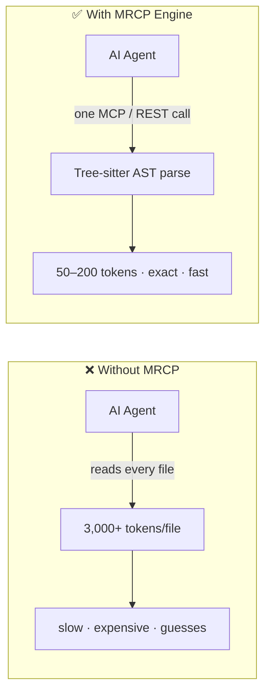
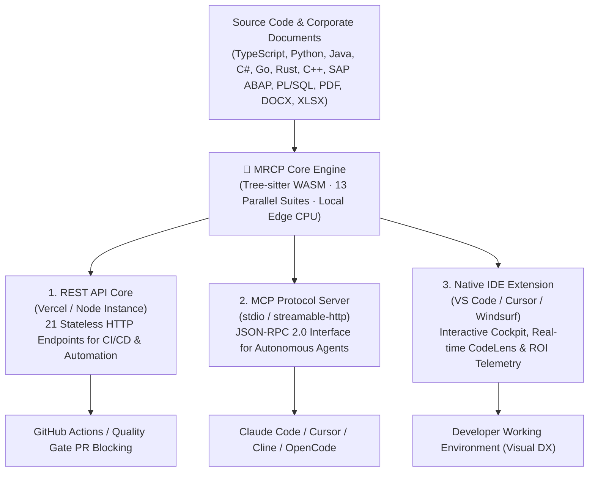

<div align="center">
    


# 🧠 MRCP Engine

### Deterministic AI Context, Code Intelligence & FinOps Architecture for AI

**Stop feeding your AI agent raw source code. Give it structured, deterministic AST intelligence instead.**

[🇧🇷 Ler em Português](README.pt-BR.md) · [🇬🇧 English](README.md)

[](https://www.npmjs.com/package/mrcp-engine)
[](https://marketplace.visualstudio.com/items?itemName=mrcp-engine.mrcp-vscode)
[](https://modelcontextprotocol.io)
[](https://github.com/faelscarpato/mrcp-engine/actions/workflows/ci.yml)
[](LICENSE)

<br/>

| 🌐 1. REST API Core | 🔌 2. MCP Protocol Server | 🧩 3. Native IDE Extension |
| :--- | :--- | :--- |
| 21 plain HTTP endpoints for CI/CD pipelines, automated quality gates, and custom enterprise integrations. | Zero-config JSON-RPC 2.0 interface feeding structured AST contracts and skill sets directly to coding agents. | Interactive Cockpit dashboard, inline CodeLens, and real-time security alerts inside VS Code, Cursor & Windsurf. |

<br/>

[Quick Start](#-quick-start-30-seconds) · [Architecture & Distribution](#-three-ways-to-consume-mrcp) · [Why MRCP](#-why-mrcp-engine) · [Tool Catalog](#-tool-catalog) · [REST API](#-rest-api-reference) · [IDE Extension](#-ide-extension-vs-code--cursor--windsurf)

</div>

---

## The problem

Every time an AI coding agent reads your repository by opening file after file, it pays the **"AI Tax"**: thousands of wasted tokens, slower responses, and a high probability of hallucinating over half-read codebases.

**MRCP Engine** is a deterministic, AST-based intelligence and FinOps layer that sits between your repository and your AI agent. Instead of dumping raw files into the context window, it parses your code once using **Tree-sitter WebAssembly** on the local CPU. It hands back strictly structured JSON schemas — architectural dependency graphs, security audits, exact type signatures, dead code reachability, tabular data schemas, and refactoring contracts.



No LLM calls are used for structural analysis. Pure deterministic parsing turns an entire codebase into an ultra-lean context package your agent can immediately consume without hallucinations.

---

## ⚡ Quick Start (30 seconds)

Auto-configure every MCP-compatible IDE and AI agent installed on your machine with a single command:

```bash
npx mrcp-engine setup
```

This automatically detects your environment and wires up the MCP server across:

|                   |                    |               |             |
| ----------------- | ------------------ | ------------- | ----------- |
| 🟢 Claude Desktop | 🟢 Claude Code     | 🟢 Cursor     | 🟢 Windsurf |
| 🟢 VS Code        | 🟢 Antigravity IDE | 🟢 Gemini CLI | 🟢 OpenCode |
| 🟢 Ollama (MCP)   | 🟢 Codex           |               |             |

### Manual Configuration

Add this directly to your client's MCP configuration file:

```json
{
  "mcpServers": {
    "mrcp-engine": {
      "command": "npx",
      "args": ["-y", "mrcp-engine@latest"]
    }
  }
}
```

Or connect any remote-HTTP-capable client (Cursor, Windsurf, VS Code, Antigravity) directly to the hosted cloud endpoint without installing local dependencies:

```json
{
  "mcpServers": {
    "mrcp-engine": {
      "url": "https://mrcp-engine.vercel.app/api/mcp",
      "transport": "streamable-http"
    }
  }
}
```

No MCP client available? Every tool is also exposed as a standard `GET`/`POST` REST endpoint.

---

## 🎯 Three Ways to Consume MRCP

MRCP Engine operates as a single deterministic core delivered through three distinct integration layers:



### 1. 🌐 REST API Core (CI/CD & Cloud Pipelines)
Every tool operates as a stateless HTTP endpoint. It allows external services, custom CLI scripts, and continuous integration pipelines to enforce architectural boundaries and generate contracts without requiring local runtimes:
* **Base URL:** `https://mrcp-engine.vercel.app`
* **Single Tool Inspection:** `GET /api/code-health?repo=<url>`
* **Full Diagnostic Execution:** `GET /api/full-analysis?repo=<url>`
* **Reactive CI/CD Gate:** Integrates with GitHub Actions to block breaking PRs by comparing cyclomatic complexity, circular dependencies, and security leaks before merge.

### 2. 🔌 MCP Protocol Server (Autonomous AI Agents)
Exposes all analytical tools and refactoring contracts via the Model Context Protocol (JSON-RPC 2.0):
* **Zero Configuration:** Run `npx mrcp-engine setup` to auto-detect and patch configuration files across installed coding agents.
* **Active Governance:** Rather than leaving the AI to inspect files randomly, MRCP delivers delimited micro-contracts with explicit skill instructions and file-modification prohibitions, stopping hallucinations at the perimeter.
* **Direct stdio execution:** `npx -y mrcp-engine@latest`

### 3. 🧩 Native IDE Extension (Visual Developer Experience)
The official UI client published on the Visual Studio Marketplace. It provides full offline telemetry, real-time ROI tracking, problems panel diagnostics, and function-level CodeLens directly in your editor.

---

## 🤔 Why MRCP Engine?

| Feature | Raw Context Stuffing | MRCP Engine |
| :--- | :--- | :--- |
| **Parsing Strategy** | LLM re-reads full raw file text | Deterministic Tree-sitter AST parse |
| **Token Cost** | ~3,000+ tokens per average file | ~50–200 tokens per structured response |
| **Consistency** | Varies by prompt; subject to hallucinations | Strictly typed, invariant JSON schema |
| **Repository Scope** | Linear inspection (one file at a time) | Whole-repository dependency graph in a single call |
| **Non-Code Assets** | Ignored or unparsed | CSV, DOCX, XLSX, PDF, JSON, YAML, XML via `mrcp_document_analyzer` |
| **Security & Governance** | Passive guessing | Built-in OWASP detection, secret audit, and modification guardrails |

### 📊 Proven Telemetry & ROI (Cockpit Ground Truth)

Tested against enterprise codebases, MRCP replaces brute-force raw context ingestion with deterministic AST compression:

| Metric | Raw Ingestion (Baseline) | MRCP Engine (AST Pack) | Net Optimization |
| :--- | :--- | :--- | :--- |
| **Analyzed Volume** | 1,936,508 tokens | **594 tokens** | **~98% Context Reduction** |
| **Cost per Analysis (GPT-4o)** | ~$5.82 USD | **~$0.002 USD** | **~$5.81 USD saved / query** |
| **Analysis Latency** | Several minutes (GPU token generation) | **< 2.0s (Local CPU execution)** | **Zero Cloud Overhead** |
| **Precision** | Probabilistic heuristics (risk of hallucination) | **13 parallel deterministic suites** | **Deterministic Ground Truth** |

> **Enterprise FinOps Projection:** For an engineering team of 10 developers performing 20 architectural queries per day, MRCP prevents over **$25,000 USD/month** in redundant cloud LLM spend while keeping source code 100% offline.

---

## 🛠 Tool Catalog

<details open>
<summary><b>1. 🏗️ Core Engine & Document Intelligence</b></summary>

| Tool | Endpoint | Description |
| :--- | :--- | :--- |
| `analyze_repository` | `GET /api/analyze?repo=<url>` | Structural AST graph: nodes (files/modules/functions), edges (dependencies), cyclomatic complexity, coupling, hotspots. |
| `mrcp_document_analyzer` | `GET /api/document-analyzer?repo=<url>` | Deterministic parser for **non-code** files: CSV, TSV, TXT, MD, DOCX, XLSX, XLS, PDF (text layer), JSON, YAML, XML, LOG. Generates knowledge graphs, tabular TypeScript interfaces, a Document Quality Index (0–100), and link validation without OCR. |
| `get_repository_skills_contract` | `GET /api/skills?repo=<url>` | Refactoring contracts for hotspot files (complexity > 50), enforcing a Zero Regression Policy on public signatures. |
| `mrcp_run_full_repository_suite` | `GET /api/full-suite?repo=<url>` | Executes all 13 core analysis tools in parallel and writes an executive diagnostic summary. |

</details>

<details open>
<summary><b>2. ⚡ High-Efficiency Agent Offloading</b></summary>

| Tool | Endpoint | Description |
| :--- | :--- | :--- |
| `mrcp_api_contract_generator` | `GET /api/api-contract?repo=<url>` | Extracts route definitions and handlers (Next.js, Express, Fastify, Hono, FastAPI, Flask) into OpenAPI 3.0.3 specs and typed TypeScript SDKs. |
| `mrcp_monorepo_package_graph_analyzer` | `GET /api/monorepo-graph?repo=<url>` | Maps pnpm, Turborepo, Lerna, and Nx package topologies, dependency trees, build order, and diff impact. |
| `mrcp_docstring_api_doc_generator` | `GET /api/doc-generator?repo=<url>` | Generates TSDoc, JSDoc, Python docstrings, and Markdown reference tables for undocumented public symbols. |
| `mrcp_ast_refactor_applier` | `POST /api/refactor-applier` | Applies batch AST refactoring (renaming symbols, extracting interfaces, updating import paths) across dozens of files in ~30ms. |
| `mrcp_type_signature_extractor` | `GET /api/type-signature-extractor?repo=<url>` | Extracts strictly type signatures, `.d.ts` declarations, and Zod schemas while stripping implementation bodies (reducing ~3,000 to ~50 tokens). |
| `mrcp_git_diff_semantic_summarizer` | `POST /api/diff-summarizer` | Removes formatting and whitespace noise from diffs, grouping semantic modifications at the AST level. |
| `mrcp_dependency_compatibility_resolver` | `GET /api/dependency-resolver?package=<name>` | Checks SemVer compatibility, peer-dependency conflicts, and breaking-change risks against the live npm registry. |
| `mrcp_dead_code_pruner` | `GET /api/dead-code-pruner?repo=<url>` | AST reachability analysis identifying unused exports, orphan variables, and unreferenced imports. |
| `mrcp_sql_schema_orm_contract_generator` | `GET /api/sql-orm-contract?repo=<url>` | Parses Prisma, SQL DDL, Drizzle, and TypeORM definitions into typed schema representations. |

</details>

<details open>
<summary><b>3. 🛡️ Predictive Engineering & Security Auditing</b></summary>

| Tool | Endpoint | Description |
| :--- | :--- | :--- |
| `mrcp_code_metrics_health_scorer` | `GET /api/code-health?repo=<url>` | Maintainability Index (0–100), technical debt grades (A–F), cognitive load distribution, and refactoring priority matrices. |
| `mrcp_env_secret_contract_validator` | `GET /api/env-validator?repo=<url>` | Maps `process.env` / `os.environ` usage, validates parity against `.env.example`, flags client-side leak risks, and outputs Zod schemas. |
| `mrcp_impact_analysis` | `POST /api/impact-analysis` | Calculates the AST blast radius by identifying all downstream files and tests affected by a changeset prior to commit. |
| `mrcp_security_compliance_audit` | `GET /api/security-audit?repo=<url>` | Audits OWASP vulnerabilities, hardcoded credentials, unsafe shell executions, deprecated dependencies, and copyleft (GPL) license exposure. |
| `mrcp_architectural_drift_detector` | `GET /api/architecture-drift?repo=<url>` | Discovers architectural drift, circular import chains (Tarjan's algorithm), and Clean Architecture layer violations. |
| `mrcp_auto_test_coverage_gap_finder` | `GET /api/test-gap-analysis?repo=<url>` | Maps complex, untested code paths and outputs scaffolded Vitest/Jest unit test stubs. |
| `mrcp_context_pruning_pack` | `GET /api/context-pack?repo=<url>&task=<desc>` | Task-aware AST context slicing that discards unrelated files to yield 60–90% token reduction. |

</details>

<details>
<summary><b>4. 🌐 Web Search & Reverse Engineering</b></summary>

| Tool | Endpoint | Description |
| :--- | :--- | :--- |
| `mrcp_web_search` | `GET /api/web-search?q=<query>` | Zero-API-key semantic web search. |
| `mrcp_web_scrape` | `GET /api/scrape?url=<url>` | Clean body extraction stripped of navigation, styling, scripts, and advertisements. |
| `mrcp_web_smart_search` | `GET /api/smart-search?q=<query>&topN=2` | Search engine querying combined with deep context scraping of top results. |
| `mrcp_clone_page` | `GET/POST /api/clone?url=<url>` | **PageCloner Pro:** Deconstructs web interfaces into design tokens, DOM component trees, semantic layouts, and prompts for code reconstruction. |

</details>

<details>
<summary><b>5. 👥 Triage & Technical Recruitment</b></summary>

| Tool | Description |
| :--- | :--- |
| `mrcp_triage_parse_resume` | Deterministic extraction of technical competencies, years of experience, and project scope from PDF/DOCX candidate profiles. |
| `mrcp_triage_score_candidate` | Generates a weighted qualification score matching candidate skills against repository architecture requirements. |
| `mrcp_triage_generate_hr_report` | Formats an executive technical screening report with targeted interview questions regarding candidate weak spots. |

</details>

---

## 🌐 REST API Reference

Every engine analyzer is accessible as a standard stateless HTTP endpoint:

```bash
curl "https://mrcp-engine.vercel.app/api/analyze?repo=https://github.com/your-org/your-repo"
```

| Endpoint | Method | Description |
| :--- | :--- | :--- |
| `/api/analyze?repo=<url>` | `GET` | Structural AST graph, dependency edges, and cyclomatic complexity. |
| `/api/skills?repo=<url>` | `GET` | Actionable refactoring contracts for identified hotspot files. |
| `/api/api-contract?repo=<url>` | `GET` | Full route extraction, OpenAPI 3.0 schema, and typed TypeScript SDK. |
| `/api/code-health?repo=<url>` | `GET` | Maintainability Index, cognitive debt scores, and refactoring effort estimations. |
| `/api/env-validator?repo=<url>` | `GET` | Runtime `.env` validation, secret leak detection, and Zod schemas. |
| `/api/monorepo-graph?repo=<url>` | `GET` | Inter-package workspace dependency tree and optimal build ordering. |
| `/api/doc-generator?repo=<url>` | `GET` | Automatic JSDoc/TSDoc extraction and Markdown API tables. |
| `/api/refactor-applier` | `POST` | Batch AST symbol renames, interface extractions, and import re-wiring. |
| `/api/type-signature-extractor?repo=<url>` | `GET` | Implementation-free type signature and declaration extraction. |
| `/api/diff-summarizer` | `POST` | Semantic Git diff categorization grouped by AST boundaries. |
| `/api/dependency-resolver?package=<name>` | `GET` | SemVer resolution and peer dependency conflict evaluation. |
| `/api/dead-code-pruner?repo=<url>` | `GET` | Detection of unreferenced exports, functions, and dead variables. |
| `/api/sql-orm-contract?repo=<url>` | `GET` | Schema extraction from Prisma, Drizzle, TypeORM, and raw SQL DDL. |
| `/api/impact-analysis` | `POST` | Blast radius analysis of changes (`body: { repoUrl, modifiedFiles }`). |
| `/api/security-audit?repo=<url>` | `GET` | Static security audit, vulnerable dependencies, and GPL license checks. |
| `/api/architecture-drift?repo=<url>` | `GET` | Circular dependency detection and architectural layer boundary audits. |
| `/api/test-gap-analysis?repo=<url>` | `GET` | Coverage gap discovery with generated unit test stubs. |
| `/api/context-pack?repo=<url>&task=<desc>` | `GET` | Context package pruned for specific agent implementation tasks. |
| `/api/clone?url=<url>` | `GET/POST` | **PageCloner Pro:** Token extraction, layout breakdown, and reconstruction prompt. |
| `/api/page-prompt?url=<url>` | `GET` | Markdown prompt generation for rebuilding existing web pages. |
| `/api/full-analysis` | `GET` | Single-call parallel execution of all 13 core diagnostic engines. |
| `/api/mcp` | `POST` | Central JSON-RPC 2.0 streaming HTTP endpoint for remote MCP agents. |

---

## 🧩 IDE Extension (VS Code · Cursor · Windsurf)

The official IDE client brings MRCP's deterministic telemetry directly into the developer's editing environment.

<div align="center">
  <a href="https://marketplace.visualstudio.com/items?itemName=mrcp-engine.mrcp-vscode">
    
  </a>
</div>

### Installation

* **Marketplace UI:** Open the Extensions tab (`Ctrl+Shift+X` / `Cmd+Shift+X`) in VS Code, Cursor, or Windsurf and search for **`mrcp-engine`**.
* **VS Code CLI:**
```bash
code --install-extension mrcp-engine.mrcp-vscode
```
* **Cursor CLI:**
```bash
cursor --install-extension mrcp-engine.mrcp-vscode
```

### Native Editor Capabilities

#### 1. 🏥 Interactive Webview Cockpit (Dashboard)
Runs 13 parallel AST suites in ~2 seconds over the local workspace on startup with zero network calls:
* **Token ROI & FinOps Telemetry:** Displays exact token and dollar savings per query by comparing baseline raw file sizes against AST-packed context (e.g., **1,936,508 raw tokens compressed to 594 AST tokens**, delivering **~98% context reduction** and saving **~$5.81 USD** per query).
* **Health Scoring & Maintainability:** Live SEI-standard Maintainability Index (0–100), Cyclomatic Complexity averages, and technical debt grades (Grade A–F).
* **Hotspot & God Module Matrix:** Direct links to jump to high-complexity functions (>50 complexity) and tangled dependencies.
* **Document Intelligence (DQI):** Real-time scoring and schema inference across non-code files (PDF, DOCX, XLSX, CSV, Markdown).

#### 2. ⚡ Inline Function-Level CodeLens
Active across TypeScript, JavaScript, Python, Go, Rust, Java, C/C++, PHP, Ruby, C#, SAP CDS, SAP ABAP, and Oracle PL/SQL:
* **Visual Complexity Indicators:** Displays real-time function complexity badges directly above signatures (e.g., `⚡ MRCP: Complexidade 1 (Baixa 🟢)` vs `⚡ MRCP: Complexidade 20+ (Alta 🔴)`).
* **📋 Copiar para IA (1-Click Action):** Extracts solely the target function signature, parameter types, and immediate AST dependencies into a sanitized micro-contract, preventing the AI from ingesting or modifying unrelated codebase sections.

#### 3. 🛡️ Activity Bar Sidebar (6 Dedicated Views)
* **⚡ Ações Rápidas:** Run full suites, copy token-optimized context, trigger security scans, and export consolidated Markdown reports (`MRCP_DIAGNOSTIC_REPORT.md`).
* **🏥 Saúde & Métricas:** Live health grades, Maintainability Index metrics, and complexity distribution.
* **🛡️ Segurança & Segredos (.env):** Discovers unlinked environment variables and hardcoded keys with direct warnings routed to the VS Code Problems panel.
* **🏗️ Arquitetura & Dependências:** Circular import discovery, Next.js/FastAPI route trees, and package graphs.
* **🧪 Gaps de Testes & Código Morto:** Reachability analysis highlighting dead variables, unused exports, and unverified high-complexity functions.
* **📄 Inteligência Documental:** Tabular schema validation and Document Quality Indexing (DQI).

#### 4. ⚙️ Extension Settings

Configure scanner limits and features inside `.vscode/settings.json`:

```json
{
  "mrcp.autoAnalyzeOnSave": false,
  "mrcp.enableCodeLens": true,
  "mrcp.enableNativeDiagnostics": true,
  "mrcp.maxFiles": 2000
}
```

### Command Palette Shortcuts (`Ctrl+Shift+P` / `Cmd+Shift+P`)

| Command | Action |
| :--- | :--- |
| `mrcp.runFullSuite` | Execute the complete 13-tool diagnostic suite in the background. |
| `mrcp.openDashboard` | Launch the interactive MRCP Cockpit dashboard and AST visualizer. |
| `mrcp.copyAiContext` | Copy the token-optimized AST context package (~95–98% token reduction). |
| `mrcp.copyFileContext` | Copy the structural signature and type contract of the active file. |
| `mrcp.auditSecurity` | Run static security inspection and scan for leaked `.env` keys. |
| `mrcp.detectDeadCode` | Run reachability analysis to flag unused functions and exports. |
| `mrcp.validateEnv` | Validate environment variable declarations against codebase references. |
| `mrcp.exportReport` | Generate a consolidated diagnostic Markdown report (`MRCP_DIAGNOSTIC_REPORT.md`). |
| `mrcp.refresh` | Re-run incremental AST analysis and update UI views. |

---

## 📡 Live Instance

A hosted cloud instance is active for evaluation without local setup:

**`https://mrcp-engine.vercel.app`**

```bash
curl "https://mrcp-engine.vercel.app/api/code-health?repo=https://github.com/facebook/react"
```

---

## 🗺 Roadmap

- [x] 13-tool diagnostic suite with parallel execution
- [x] Native VS Code / Cursor / Windsurf extension published to Visual Studio Marketplace
- [x] Document intelligence and schema extraction for non-code repositories
- [x] Extended enterprise grammars (SAP ABAP, SAP CDS, Oracle PL/SQL, C#, Java)
- [ ] **v3**: Hybrid In-IDE Chat with smart model routing (BYOK + free tier proxies)
- [ ] **v3**: Native prompt caching optimization (static system prefixes & dynamic AST suffixes)
- [ ] On-demand structured file retrieval using AST index metadata

---

## 🤝 Contributing

Contributions, bug reports, and feature requests are welcome. Review [CONTRIBUTING.md](CONTRIBUTING.md) for local environment setup and [CODE_OF_CONDUCT.md](CODE_OF_CONDUCT.md) for community guidelines.

If MRCP Engine reduces your token expenditure or stabilizes your AI workflows, consider starring the repository.

## 📄 License

[MIT](LICENSE) © faelscarpato

---

<div align="center">

### ⭐ Star History

[](https://star-history.com/#faelscarpato/mrcp-engine&Date)

</div>
