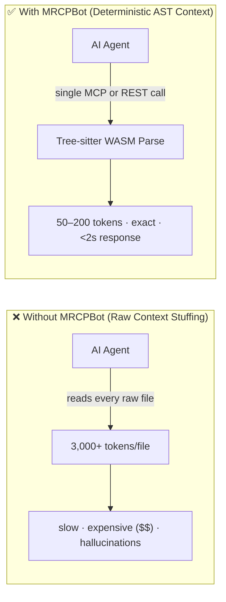
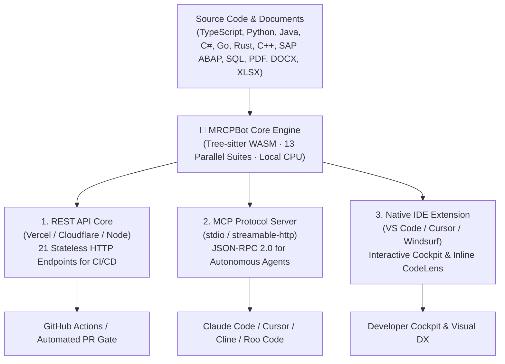

<div align="center">
    


# 🧠 MRCPBot

### Deterministic AI Context, Code Intelligence & FinOps Architecture for Autonomous Coding Agents

**Stop feeding your AI coding agents raw source files. Deliver deterministic, structured AST intelligence instead.**

[🇧🇷 Ler em Português](README.pt-BR.md) · [🇬🇧 English](README.md)

[](https://github.com/faelscarpato/mrcpbot)
[](https://www.npmjs.com/package/mrcp-engine)
[](https://marketplace.visualstudio.com/items?itemName=mrcp-engine.mrcp-vscode)
[](https://modelcontextprotocol.io)
[](https://github.com/faelscarpato/mrcpbot/actions/workflows/ci.yml)
[](LICENSE)

<br/>

| 🌐 1. REST API Core | 🔌 2. MCP Protocol Server | 🧩 3. Native IDE Extension |
| :--- | :--- | :--- |
| **21 HTTP endpoints** for CI/CD pipelines, automated PR quality gates, and cloud integrations. | **Zero-config JSON-RPC 2.0 interface** serving structured AST micro-contracts to coding agents. | **Interactive Cockpit dashboard**, inline CodeLens, and real-time security alerts inside VS Code & Cursor. |

<br/>

[Quick Start](#-quick-start-30-seconds) · [Three Ways to Consume](#-three-ways-to-consume-mrcpbot) · [Why MRCPBot](#-why-mrcpbot) · [Tool Catalog](#-tool-catalog) · [REST API Reference](#-rest-api-reference) · [IDE Extension](#-ide-extension-vs-code--cursor--windsurf) · [Deploy](#-cloud-deployment-vercel--cloudflare)

</div>

---

## 💥 The Problem: The "AI Token Tax"

Every time an AI coding agent analyzes a repository by reading entire raw files, you pay the **"AI Token Tax"**: thousands of wasted tokens, sluggish multi-turn responses, high cost per inquiry, and frequent hallucinations over code read in isolation.

**MRCPBot** acts as a deterministic, AST-driven intelligence and FinOps optimization layer between your repositories and your AI agents (Claude Code, Cursor, Windsurf, Cline, Copilot, ChatGPT). Powered by **Tree-sitter WebAssembly** executing on edge CPUs, it parses your code once without LLM invocations and returns exact, structured JSON contracts: dependency graphs, type signatures, security audits, dead code reachability, and architectural drift analysis.



---

## ⚡ Quick Start (30 seconds)

### 1. Auto-configure all local MCP clients

Auto-detect and wire up the MCP server across every supported IDE and AI agent installed on your machine:

```bash
npx mrcp-engine setup
```

Compatible out of the box with:

|                   |                    |               |             |
| ----------------- | ------------------ | ------------- | ----------- |
| 🟢 Claude Desktop | 🟢 Claude Code     | 🟢 Cursor     | 🟢 Windsurf |
| 🟢 VS Code        | 🟢 Antigravity IDE | 🟢 Gemini CLI | 🟢 OpenCode |
| 🟢 Ollama (MCP)   | 🟢 Codex           | 🟢 Cline      | 🟢 Roo Code |

### 2. Manual Client Configuration

Add this directly to your editor's `mcpServers` configuration file:

```json
{
  "mcpServers": {
    "mrcpbot": {
      "command": "npx",
      "args": ["-y", "mrcp-engine@latest"]
    }
  }
}
```

### 3. Remote HTTP Streaming (No local runtime required)

Connect any client supporting remote HTTP MCP (Cursor, Windsurf, VS Code) directly to the hosted cloud endpoint:

```json
{
  "mcpServers": {
    "mrcpbot": {
      "url": "https://mrcp-engine.vercel.app/api/mcp",
      "transport": "streamable-http"
    }
  }
}
```

---

## 🎯 Three Ways to Consume MRCPBot

MRCPBot delivers its deterministic AST engine through three flexible integration layers:



### 1. 🌐 REST API Core (CI/CD & Automated Gates)
Stateless HTTP endpoints designed for GitHub Actions, GitLab CI, or custom CLI tools. Block breaking PRs by asserting against cyclomatic complexity, circular dependencies, and security leaks before merge.

### 2. 🔌 MCP Protocol Server (Autonomous AI Agents)
Implements the Model Context Protocol (JSON-RPC 2.0). Delivers strict micro-contracts with explicit skill boundaries and file modification constraints, eliminating hallucinations at the source.

### 3. 🧩 Native IDE Extension (Visual Developer Experience)
Published on the Visual Studio Marketplace. Provides live workspace health telemetry, function-level CodeLens complexity badges, and a 1-click **"Copiar para IA"** micro-contract generator.

---

## 📊 Proven Telemetry & ROI

Benchmarked against enterprise repositories, MRCPBot replaces raw file ingestion with compact AST context:

| Metric | Raw Context Ingestion | MRCPBot AST Context | Net Optimization |
| :--- | :--- | :--- | :--- |
| **Analyzed Context Volume** | 1,936,508 tokens | **594 tokens** | **~98% Context Reduction** |
| **Cost per Analysis (GPT-4o)** | ~$5.82 USD | **~$0.002 USD** | **~$5.81 USD saved / query** |
| **Analysis Latency** | Minutes (LLM token generation) | **< 2.0s (Local CPU execution)** | **Instant Ground Truth** |
| **Precision** | Probabilistic (hallucination risk) | **13 deterministic AST suites** | **Zero Guesswork** |

> **FinOps Impact:** For a team of 10 engineers running 20 queries daily, MRCPBot saves over **$25,000 USD/month** in model inference costs while ensuring code remains secure.

---

## 🛠 Tool Catalog

<details open>
<summary><b>1. 🏗️ Core Engine & Document Intelligence</b></summary>

| Tool | Endpoint | Description |
| :--- | :--- | :--- |
| `analyze_repository` | `GET /api/analyze?repo=<url>` | AST dependency graph, cyclomatic complexity, coupling, and hotspot identification. |
| `mrcp_document_analyzer` | `GET /api/document-analyzer?repo=<url>` | Deterministic parser for non-code files: CSV, TSV, MD, DOCX, XLSX, PDF (text layer), JSON, YAML, XML, LOG. Generates schemas and Document Quality Index (DQI). |
| `get_repository_skills_contract` | `GET /api/skills?repo=<url>` | Generates actionable refactoring contracts for hotspot modules (complexity > 50) with zero-regression policies. |
| `mrcp_run_full_repository_suite` | `GET /api/full-suite?repo=<url>` | Executes all 13 core analysis tools in parallel and returns an executive diagnostic report. |

</details>

<details open>
<summary><b>2. ⚡ High-Efficiency Agent Offloading</b></summary>

| Tool | Endpoint | Description |
| :--- | :--- | :--- |
| `mrcp_api_contract_generator` | `GET /api/api-contract?repo=<url>` | Extracts API handlers (Next.js, Express, Fastify, Hono, FastAPI, Flask) into OpenAPI 3.0.3 specs and TypeScript SDKs. |
| `mrcp_monorepo_package_graph_analyzer` | `GET /api/monorepo-graph?repo=<url>` | Maps pnpm, Turborepo, Lerna, and Nx topologies, dependency trees, and build orders. |
| `mrcp_docstring_api_doc_generator` | `GET /api/doc-generator?repo=<url>` | Generates TSDoc, JSDoc, Python docstrings, and Markdown tables for undocumented symbols. |
| `mrcp_ast_refactor_applier` | `POST /api/refactor-applier` | Applies AST refactoring (renaming symbols, extracting interfaces, updating imports) across files in ~30ms. |
| `mrcp_type_signature_extractor` | `GET /api/type-signature-extractor?repo=<url>` | Extracts type signatures, declarations, and Zod schemas while stripping implementation logic. |
| `mrcp_git_diff_semantic_summarizer` | `POST /api/diff-summarizer` | Filters formatting noise and summarizes semantic changes at the AST node level. |
| `mrcp_dependency_compatibility_resolver` | `GET /api/dependency-resolver?package=<name>` | Evaluates SemVer compatibility and peer-dependency conflicts against live registries. |
| `mrcp_dead_code_pruner` | `GET /api/dead-code-pruner?repo=<url>` | AST reachability analysis identifying unused exports, orphan functions, and unreferenced imports. |
| `mrcp_sql_schema_orm_contract_generator` | `GET /api/sql-orm-contract?repo=<url>` | Extracts typed schema models from Prisma, Drizzle, TypeORM, and raw SQL DDL. |

</details>

<details open>
<summary><b>3. 🛡️ Predictive Engineering & Security Auditing</b></summary>

| Tool | Endpoint | Description |
| :--- | :--- | :--- |
| `mrcp_code_metrics_health_scorer` | `GET /api/code-health?repo=<url>` | Maintainability Index (0–100), technical debt ratings (A–F), and cognitive load distribution. |
| `mrcp_env_secret_contract_validator` | `GET /api/env-validator?repo=<url>` | Maps environment variable usage, validates parity against `.env.example`, and flags leaks. |
| `mrcp_impact_analysis` | `POST /api/impact-analysis` | Computes the AST blast radius by identifying all downstream files and tests affected by a changeset. |
| `mrcp_security_compliance_audit` | `GET /api/security-audit?repo=<url>` | Audits OWASP vulnerabilities, hardcoded credentials, unsafe shell executions, and GPL license risks. |
| `mrcp_architectural_drift_detector` | `GET /api/architecture-drift?repo=<url>` | Detects circular dependencies (Tarjan's algorithm) and clean architecture layer violations. |
| `mrcp_auto_test_coverage_gap_finder` | `GET /api/test-gap-analysis?repo=<url>` | Identifies untested complex code paths and outputs scaffolded Vitest/Jest test suites. |
| `mrcp_context_pruning_pack` | `GET /api/context-pack?repo=<url>&task=<desc>` | Task-aware context slicing that prunes unrelated code to yield 60–90% token savings. |

</details>

<details>
<summary><b>4. 🌐 Web Search & Reverse Engineering</b></summary>

| Tool | Endpoint | Description |
| :--- | :--- | :--- |
| `mrcp_web_search` | `GET /api/web-search?q=<query>` | Clean, zero-API-key web search. |
| `mrcp_web_scrape` | `GET /api/scrape?url=<url>` | Boilerplate-free markdown/text extraction from web pages. |
| `mrcp_web_smart_search` | `GET /api/smart-search?q=<query>&topN=2` | Hybrid search combining top-result scraping and synthesis. |
| `mrcp_clone_page` | `GET/POST /api/clone?url=<url>` | **PageCloner Pro:** Deconstructs web interfaces into design tokens, DOM hierarchies, and reconstruction prompts. |

</details>

---

## 🌐 REST API Reference

All analyzers can be triggered via standard HTTP calls:

```bash
# Analyze repository maintainability and complexity
curl "https://mrcp-engine.vercel.app/api/code-health?repo=https://github.com/faelscarpato/mrcpbot"

# Extract compact AST context package
curl "https://mrcp-engine.vercel.app/api/context-pack?repo=https://github.com/faelscarpato/mrcpbot&task=refactor-auth"
```

| Endpoint | Method | Description |
| :--- | :--- | :--- |
| `/api/code-health?repo=<url>` | `GET` | Maintainability Index, cognitive debt scores, and refactoring effort. |
| `/api/context-pack?repo=<url>&task=<desc>` | `GET` | Generates token-pruned AST context slices for agent prompt insertion. |
| `/api/analyze?repo=<url>` | `GET` | Structural AST graph, dependency edges, and cyclomatic complexity. |
| `/api/skills?repo=<url>` | `GET` | Hotspot refactoring contracts with zero-regression constraints. |
| `/api/api-contract?repo=<url>` | `GET` | Route extraction, OpenAPI 3.0 specs, and TypeScript SDK definitions. |
| `/api/env-validator?repo=<url>` | `GET` | Environment variable parity validation and secret exposure checks. |
| `/api/monorepo-graph?repo=<url>` | `GET` | Monorepo dependency topology and optimal build execution order. |
| `/api/security-audit?repo=<url>` | `GET` | Static security audit, dependency checks, and license compliance. |
| `/api/architecture-drift?repo=<url>` | `GET` | Circular import detection and architectural boundary violations. |
| `/api/dead-code-pruner?repo=<url>` | `GET` | Reachability analysis flagging unreferenced functions and exports. |
| `/api/full-analysis` | `GET` | Single-call parallel execution of all 13 core diagnostic suites. |
| `/api/mcp` | `POST` | Central JSON-RPC 2.0 streaming HTTP endpoint for remote MCP agents. |

---

## 🧩 IDE Extension (VS Code · Cursor · Windsurf)

The official IDE client integrates MRCPBot intelligence directly into your editor:

<div align="center">
  <a href="https://marketplace.visualstudio.com/items?itemName=mrcp-engine.mrcp-vscode">
    
  </a>
</div>

### Installation

* **From Editor Marketplace:** Search for **`mrcp-engine`** in VS Code, Cursor, or Windsurf.
* **Via VS Code CLI:**
  ```bash
  code --install-extension mrcp-engine.mrcp-vscode
  ```
* **Via Cursor CLI:**
  ```bash
  cursor --install-extension mrcp-engine.mrcp-vscode
  ```

### Key Capabilities

1. **Interactive Cockpit Dashboard:** Runs 13 parallel AST suites in ~2 seconds over the local workspace with zero network traffic. Displays live Maintainability Index, token ROI telemetry, and technical debt grades.
2. **Inline Function CodeLens:** Badges complexity directly above function signatures (e.g., `⚡ MRCP: Complexidade 1 (Baixa 🟢)`) with a 1-click action to copy a sanitized micro-contract for coding agents.
3. **Dedicated Activity Bar Views:** 6 focused panels covering Quick Actions, Health & Metrics, Security & Secrets, Architecture & Dependencies, Test Gaps & Dead Code, and Document Intelligence.

---

## 🚀 Cloud Deployment (Vercel & Cloudflare)

MRCPBot is built to deploy seamlessly to modern edge platforms without manual configuration:

### Deploy to Vercel

Configured via `vercel.json` with pre-routed serverless functions (`/api/*`) and SPA static hosting:

```bash
vercel deploy --prod
```

### Deploy to Cloudflare Pages

Configured via `wrangler.toml` with `public/_redirects` and `public/_headers` for automatic SPA fallback:

```bash
pnpm build
wrangler pages deploy dist --project-name=mrcpbot
```

---

## 🛠️ Development & Contributing

### Monorepo Setup

```bash
# Clone the repository
git clone https://github.com/faelscarpato/mrcpbot.git
cd mrcpbot

# Install dependencies (managed via pnpm workspaces)
pnpm install

# Run linters and tests
pnpm lint
pnpm test

# Launch local development server
pnpm dev
```

Contributions, bug reports, and suggestions are welcome! Please check out [CONTRIBUTING.md](CONTRIBUTING.md) and [CODE_OF_CONDUCT.md](CODE_OF_CONDUCT.md).

---

## 📄 License

This project is licensed under the [MIT License](LICENSE) © faelscarpato.

<div align="center">
  <sub>Built with ❤️ by <a href="https://github.com/faelscarpato">Rafael Scarpato</a> and the open-source community.</sub>
</div>
