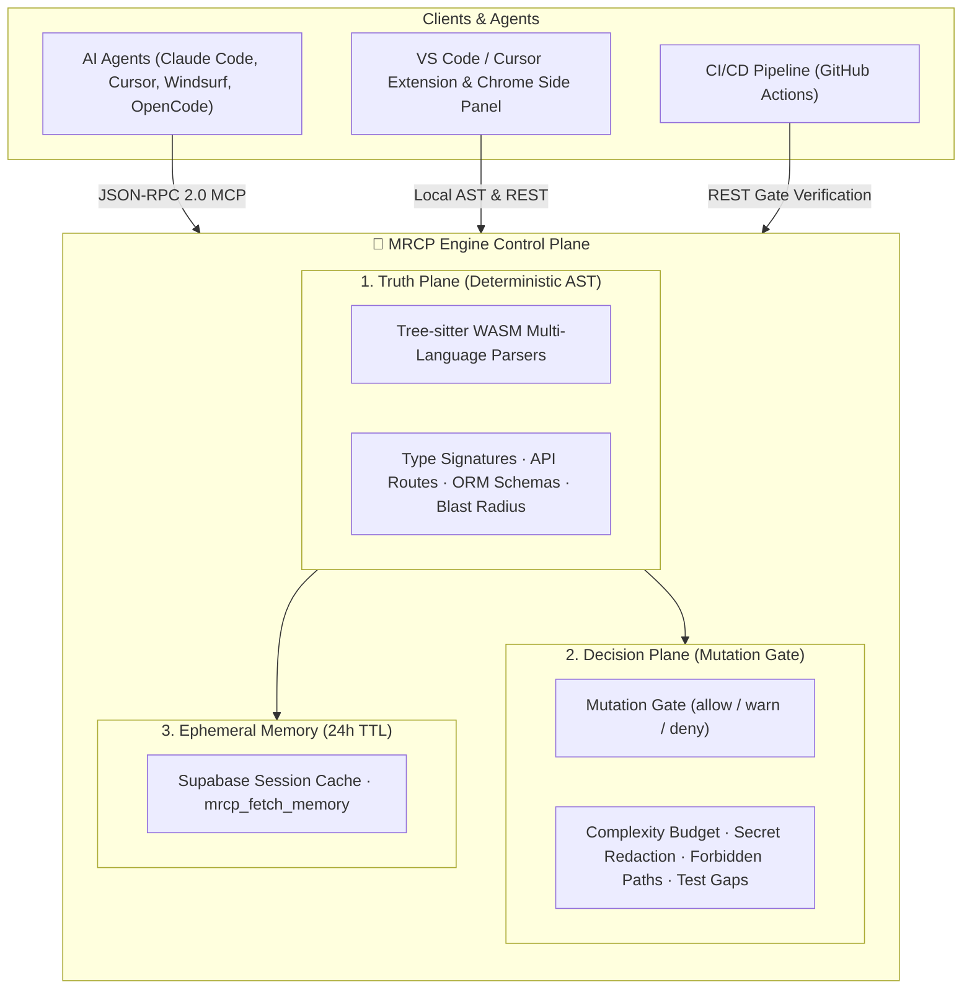

<div align="center">


# 🧠 MRCP Engine

### Deterministic Code Intelligence, Autonomous RAG & Mutation Governance for AI Agents

**Stop feeding your AI agent raw source code. Give it structured, deterministic AST intelligence and cryptographic mutation guardrails.**

[🇧🇷 Ler em Português](README.pt-BR.md) · [🇬🇧 English](README.md)

[](https://www.npmjs.com/package/mrcp-engine)
[](https://marketplace.visualstudio.com/items?itemName=mrcp-engine.mrcp-vscode)
[](https://modelcontextprotocol.io)
[](https://github.com/faelscarpato/mrcp-engine/actions/workflows/ci.yml)
[](LICENSE)

<br/>

| 🌐 1. REST API Core | 🔌 2. MCP Protocol Server | 🧩 3. IDE & Browser Extensions |
| :--- | :--- | :--- |
| Stateless HTTP endpoints for CI/CD pipelines, automated **Mutation Gates**, and autonomous **Structural RAG**. | Zero-config JSON-RPC 2.0 interface feeding AST contracts, 24h ephemeral session cache, and security guardrails directly to AI agents. | Interactive Cockpit dashboard, inline CodeLens in **VS Code / Cursor / Windsurf**, plus a native **Chrome Side Panel** extension. |

<br/>

[Quick Start](#-quick-start-30-seconds) · [Architecture & 3 Planes](#-the-three-planes-of-mrcp) · [Tool Catalog](#-tool-catalog) · [REST API](#-rest-api-reference) · [VS Code Extension](#-ide-extension-vs-code--cursor--windsurf) · [Chrome Extension](#-browser-extension-google-chrome--manifest-v3)

</div>

---

## 🛑 The Problem: The AI Tax & Ungoverned Code Generation

When AI coding agents interact with codebases, two critical bottlenecks emerge:

1. **The Context Ingestion Tax ("AI Tax"):** Agents open file after file, consuming thousands of raw tokens. Responses get slower, expensive API bills pile up, and models hallucinate over partial context.
2. **Ungoverned Agentic Mutations:** Agents propose changes without architectural boundaries, introducing security leaks, license violations, circular dependencies, and untested complexity.

**MRCP Engine** acts as the **deterministic control plane** between your repository and AI agents:
- **Truth Plane (Deterministic AST):** It parses source code using **Tree-sitter WebAssembly** on local CPU with zero LLM inference. It extracts lean, typed micro-contracts (~50–600 tokens) with ~98% context reduction.
- **Decision Plane (Mutation Gate):** It validates proposed agent mutations (`POST /api/mutation-gate`) against mathematical complexity budgets, secret leak regexes (with zero-leak redaction), forbidden paths, and automated test coverage.
- **Ephemeral Session Memory (24h TTL):** Persists generated contracts into Supabase, injecting session UUIDs to prevent costly parser re-runs.



---

## ⚡ Quick Start (30 seconds)

Auto-configure every MCP-compatible IDE and AI agent installed on your machine with a single command:

```bash
npx mrcp-engine setup
```

This automatically detects your environment and wires up the MCP server across:

| | | | |
| :--- | :--- | :--- | :--- |
| 🟢 Claude Desktop | 🟢 Claude Code | 🟢 Cursor | 🟢 Windsurf |
| 🟢 VS Code | 🟢 Antigravity IDE | 🟢 Gemini CLI | 🟢 OpenCode |
| 🟢 Ollama (MCP) | 🟢 Codex | | |

### Manual Configuration

Add this directly to your client's MCP configuration file:

```json
{
  "mcpServers": {
    "mrcp-engine": {
      "command": "npx",
      "args": ["-y", "mrcp-engine@latest"]
    }
  }
}
```

Or connect any remote-HTTP-capable client directly to the cloud endpoint without local dependencies:

```json
{
  "mcpServers": {
    "mrcp-engine": {
      "url": "https://mrcp-engine.vercel.app/api/mcp",
      "transport": "streamable-http"
    }
  }
}
```

---

## 🎯 The Three Planes of MRCP

### 1. 🔍 Truth Plane (Deterministic AST Intelligence)
Zero LLMs in the analytical path. 100% reproducible AST evaluation over TypeScript, JavaScript, Python, Go, Rust, Java, C/C++, PHP, Ruby, C#, SAP CDS, SAP ABAP, and Oracle PL/SQL. It yields architectural dependency graphs, type signatures, OpenAPI schemas, and blast radius impact.

### 2. 🛡️ Decision Plane (Mutation Gate)
Provides mathematical authorization for agent-generated diffs before merge:
- **`max_files`**: Caps the blast radius of single changes.
- **`forbidden_path`**: Enforces strict boundaries against protected files (`.env`, private keys, etc.).
- **`secret_leak`**: Scans for AWS, GitHub, Supabase and generic API keys with strict redaction (returns pattern name only, never the secret value).
- **`complexity_budget`**: Recomputes cyclomatic complexity via AST from `code-health.ts` rather than trusting agent-declared values.
- **`test_coverage_gate`**: Detects whether modified source files in `src/` or `packages/` have sibling or declared unit tests.

### 3. 💾 Ephemeral Memory (Supabase Cache, 24h TTL)
When expensive repository parsing finishes, the micro-contract is cached for 24 hours. The agent receives an instructional footer:
```text
Contexto arquitetural salvo temporariamente (TTL: 24h). ID da Sessão: [UUID].
Para consultas futuras sobre esta arquitetura, utilize mrcp_fetch_memory(session_id).
```
Agents call `mrcp_fetch_memory(session_id)` to retrieve context instantly with zero parser CPU or network re-execution.

---

## 📊 Proven Telemetry & ROI

Tested against enterprise codebases, MRCP replaces brute-force raw context ingestion with deterministic AST compression:

| Metric | Raw Ingestion (Baseline) | MRCP Engine (AST Micro-Contract) | Net Optimization |
| :--- | :--- | :--- | :--- |
| **Analyzed Volume** | 1,936,508 tokens | **594 tokens** | **~98% Context Reduction** |
| **Cost per Analysis (GPT-4o)** | ~$5.82 USD | **~$0.002 USD** | **~$5.81 USD saved / query** |
| **Analysis Latency** | Several minutes (Token generation) | **< 2.0s (Local CPU execution)** | **Zero Cloud Overhead** |
| **Precision** | Probabilistic heuristics (hallucinations) | **Deterministic AST + Gate Check** | **Zero Hallucination Ground Truth** |

---

## 🛠 Tool Catalog

<details open>
<summary><b>1. 🏛️ Core Engine & Ephemeral Memory</b></summary>

| Tool | Endpoint | Description |
| :--- | :--- | :--- |
| `analyze_repository` | `GET /api/analyze?repo=<url>` | Structural AST graph: nodes (files/modules/functions), edges, cyclomatic complexity, coupling, hotspots. Auto-persists session with 24h TTL. |
| `mrcp_run_full_repository_suite` | `GET /api/full-suite?repo=<url>` | Executes all core diagnostic tools in parallel, generates Markdown executive summary, and persists 24h session. |
| `mrcp_fetch_memory` | *(MCP & Internal)* | Fetches previously parsed architectural micro-contracts by `session_id` UUID with 24h TTL check. |
| `get_repository_skills_contract` | `GET /api/skills?repo=<url>` | Actionable refactoring contracts for hotspot files (complexity > 50). |
| `mrcp_document_analyzer` | `GET /api/document-analyzer?repo=<url>` | Deterministic parser for non-code files (PDF, DOCX, XLSX, CSV, JSON, YAML, XML, LOG) with Document Quality Index (DQI). |

</details>

<details open>
<summary><b>2. 🛡️ Governance & Mutation Gate</b></summary>

| Tool | Endpoint | Description |
| :--- | :--- | :--- |
| `mrcp_gate_change` | `POST /api/mutation-gate` | Evaluates proposed changes against architectural policies (`allow/warn/deny`), checking complexity delta, secret redaction, forbidden paths, and unit test presence. |
| `mrcp_security_compliance_audit` | `GET /api/security-audit?repo=<url>` | Static AST security audit (OWASP vulnerabilities, hardcoded secrets, unsafe shell calls, GPL copyleft licenses). |
| `mrcp_impact_analysis` | `POST /api/impact-analysis` | Calculates AST blast radius of code changes, tracing downstream impacted files, functions, and unit tests. |
| `mrcp_architectural_drift_detector` | `GET /api/architecture-drift?repo=<url>` | Detects circular import chains (Tarjan's algorithm) and Clean Architecture layer violations. |
| `mrcp_auto_test_coverage_gap_finder` | `GET /api/test-gap-analysis?repo=<url>` | Maps complex, untested code paths and scaffolds Vitest/Jest unit test stubs. |

</details>

<details open>
<summary><b>3. 🧬 Autonomous Architecture (Structural RAG)</b></summary>

| Tool | Endpoint | Description |
| :--- | :--- | :--- |
| `mrcp_structural_rag_pipeline` | `POST /api/structural-rag` | Autonomous architectural research engine. Given a tech stack (e.g., `"jwt fastify redis"`), searches GitHub via backend token, executes desk scrape, extracts typed signatures, OpenAPI routes and data models, validates through Mutation Gate, and caches to Supabase. |

</details>

<details open>
<summary><b>4. ⚡ High-Efficiency Offloading & Code Contracts</b></summary>

| Tool | Endpoint | Description |
| :--- | :--- | :--- |
| `mrcp_api_contract_generator` | `GET /api/api-contract?repo=<url>` | Extracts route definitions into OpenAPI 3.0 specs and typed TypeScript SDKs. |
| `mrcp_type_signature_extractor` | `GET /api/type-signature-extractor?repo=<url>` | Extracts strictly typed signatures, `.d.ts` declarations, and Zod schemas while stripping implementation bodies (~98% token reduction). |
| `mrcp_sql_schema_orm_contract_generator` | `GET /api/sql-orm-contract?repo=<url>` | Parses Prisma, Drizzle, TypeORM, and raw SQL DDL into typed schema representations. |
| `mrcp_dead_code_pruner` | `GET /api/dead-code-pruner?repo=<url>` | AST reachability analysis identifying unused exports, orphan variables, and unreferenced imports. |
| `mrcp_context_pruning_pack` | `GET /api/context-pack?repo=<url>&task=<desc>` | Task-aware AST context slicing discarding unrelated files for focused agent tasks. |
| `mrcp_code_metrics_health_scorer` | `GET /api/code-health?repo=<url>` | SEI Maintainability Index (0–100), technical debt grades (A–F), and cognitive load distribution. |
| `mrcp_monorepo_package_graph_analyzer` | `GET /api/monorepo-graph?repo=<url>` | Maps pnpm, Turborepo, Lerna, and Nx package topologies and optimal build ordering. |
| `mrcp_docstring_api_doc_generator` | `GET /api/doc-generator?repo=<url>` | Generates TSDoc, JSDoc, and Python docstrings for undocumented public symbols. |
| `mrcp_ast_refactor_applier` | `POST /api/refactor-applier` | Batch AST symbol renames, interface extractions, and import re-wiring in ~30ms. |

</details>

---

## 🌐 REST API Reference

Every engine analyzer is accessible as a standard stateless HTTP endpoint:

```bash
# Analyze a repository AST
curl "https://mrcp-engine.vercel.app/api/analyze?repo=https://github.com/facebook/react"

# Verify a mutation through the Gate
curl -X POST "https://mrcp-engine.vercel.app/api/mutation-gate" \
  -H "Content-Type: application/json" \
  -d '{"change": {"files": [{"path": "src/auth.ts", "content": "export const token = 123;"}]}}'

# Autonomous Structural RAG
curl -X POST "https://mrcp-engine.vercel.app/api/structural-rag" \
  -H "Content-Type: application/json" \
  -d '{"query": "fastify jwt auth redis"}'
```

| Endpoint | Method | Description |
| :--- | :--- | :--- |
| `/api/analyze?repo=<url>` | `GET` | Structural AST graph, dependency edges, and cyclomatic complexity. |
| `/api/mutation-gate` | `POST` | Deterministic mutation gate verification (`allow/warn/deny`). |
| `/api/structural-rag` | `POST` | Autonomous structural search and architectural micro-contract generator. |
| `/api/full-analysis` | `GET` | Executes all core diagnostic engines in parallel. |
| `/api/skills?repo=<url>` | `GET` | Actionable refactoring contracts for hotspot files. |
| `/api/api-contract?repo=<url>` | `GET` | Full route extraction, OpenAPI 3.0 schema, and typed TypeScript SDK. |
| `/api/code-health?repo=<url>` | `GET` | Maintainability Index, cognitive debt scores, and refactoring effort. |
| `/api/env-validator?repo=<url>` | `GET` | Runtime `.env` validation, secret leak detection, and Zod schemas. |
| `/api/monorepo-graph?repo=<url>` | `GET` | Inter-package workspace dependency tree and build ordering. |
| `/api/doc-generator?repo=<url>` | `GET` | Automatic JSDoc/TSDoc extraction and Markdown API tables. |
| `/api/refactor-applier` | `POST` | Batch AST symbol renames, interface extractions, and import re-wiring. |
| `/api/type-signature-extractor?repo=<url>` | `GET` | Implementation-free type signature and declaration extraction. |
| `/api/diff-summarizer` | `POST` | Semantic Git diff categorization grouped by AST boundaries. |
| `/api/dead-code-pruner?repo=<url>` | `GET` | Detection of unreferenced exports, functions, and dead variables. |
| `/api/sql-orm-contract?repo=<url>` | `GET` | Schema extraction from Prisma, Drizzle, TypeORM, and raw SQL DDL. |
| `/api/impact-analysis` | `POST` | Blast radius analysis of changes (`body: { repoUrl, modifiedFiles }`). |
| `/api/security-audit?repo=<url>` | `GET` | Static security audit, vulnerable dependencies, and GPL license checks. |
| `/api/architecture-drift?repo=<url>` | `GET` | Circular dependency detection and layer boundary audits. |
| `/api/test-gap-analysis?repo=<url>` | `GET` | Coverage gap discovery with generated unit test stubs. |
| `/api/context-pack?repo=<url>&task=<desc>` | `GET` | Context package pruned for specific agent implementation tasks. |
| `/api/mcp` | `POST/GET` | Central JSON-RPC 2.0 streaming HTTP endpoint for remote MCP agents & Discovery. |

---

## 🧩 IDE Extension (VS Code · Cursor · Windsurf)

The official IDE client brings MRCP's deterministic telemetry directly into the developer's editing environment.

<div align="center">
  <a href="https://marketplace.visualstudio.com/items?itemName=mrcp-engine.mrcp-vscode">
    
  </a>
</div>

### Installation

- **Marketplace UI:** Open the Extensions tab (`Ctrl+Shift+X` / `Cmd+Shift+X`) in VS Code, Cursor, or Windsurf and search for **`mrcp-engine`**.
- **VS Code CLI:**
  ```bash
  code --install-extension mrcp-engine.mrcp-vscode
  ```
- **Cursor CLI:**
  ```bash
  cursor --install-extension mrcp-engine.mrcp-vscode
  ```

### Native Editor Capabilities

#### 1. 🏥 Interactive Webview Cockpit (Dashboard)
Runs AST analysis in ~2 seconds over the local workspace on startup with zero network calls:
- **Token ROI & FinOps Telemetry:** Displays exact token and dollar savings per query by comparing baseline raw file sizes against AST-packed context (e.g., **1,936,508 raw tokens compressed to 594 AST tokens**, delivering **~98% context reduction** and saving **~$5.81 USD** per query).
- **Health Scoring & Maintainability:** Live SEI-standard Maintainability Index (0–100), Cyclomatic Complexity averages, and technical debt grades (Grade A–F).
- **Hotspot & God Module Matrix:** Direct links to jump to high-complexity functions (>50 complexity) and tangled dependencies.
- **Document Intelligence (DQI):** Real-time scoring and schema inference across non-code files (PDF, DOCX, XLSX, CSV, Markdown).

#### 2. ⚡ Inline Function-Level CodeLens
Active across TypeScript, JavaScript, Python, Go, Rust, Java, C/C++, PHP, Ruby, C#, SAP CDS, SAP ABAP, and Oracle PL/SQL:
- **Visual Complexity Indicators:** Displays real-time function complexity badges directly above signatures (e.g., `⚡ MRCP: Complexidade 1 (Baixa 🟢)` vs `⚡ MRCP: Complexidade 20+ (Alta 🔴)`).
- **📋 Copiar para IA (1-Click Action):** Extracts solely the target function signature, parameter types, and immediate AST dependencies into a sanitized micro-contract, preventing the AI from ingesting or modifying unrelated codebase sections.

#### 3. 🛡️ Activity Bar Sidebar (6 Dedicated Views)
- **⚡ Ações Rápidas:** Run full suites, copy token-optimized context, trigger security scans, and export consolidated Markdown reports (`MRCP_DIAGNOSTIC_REPORT.md`).
- **🏥 Saúde & Métricas:** Live health grades, Maintainability Index metrics, and complexity distribution.
- **🛡️ Segurança & Segredos (.env):** Discovers unlinked environment variables and hardcoded keys with direct warnings routed to the VS Code Problems panel.
- **🏗️ Arquitetura & Dependências:** Circular import discovery, Next.js/FastAPI route trees, and package graphs.
- **🧪 Gaps de Testes & Código Morto:** Reachability analysis highlighting dead variables, unused exports, and unverified high-complexity functions.
- **📄 Inteligência Documental:** Tabular schema validation and Document Quality Indexing (DQI).

#### 4. ⚙️ Extension Settings
Configure scanner limits and features inside `.vscode/settings.json`:
```json
{
  "mrcp.autoAnalyzeOnSave": false,
  "mrcp.enableCodeLens": true,
  "mrcp.enableNativeDiagnostics": true,
  "mrcp.maxFiles": 2000
}
```

### Command Palette Shortcuts (`Ctrl+Shift+P` / `Cmd+Shift+P`)

| Command | Action |
| :--- | :--- |
| `mrcp.runFullSuite` | Execute the complete diagnostic suite in the background. |
| `mrcp.openDashboard` | Launch the interactive MRCP Cockpit dashboard and AST visualizer. |
| `mrcp.copyAiContext` | Copy the token-optimized AST context package (~95–98% token reduction). |
| `mrcp.copyFileContext` | Copy the structural signature and type contract of the active file. |
| `mrcp.auditSecurity` | Run static security inspection and scan for leaked `.env` keys. |
| `mrcp.detectDeadCode` | Run reachability analysis to flag unused functions and exports. |
| `mrcp.validateEnv` | Validate environment variable declarations against codebase references. |
| `mrcp.exportReport` | Generate a consolidated diagnostic Markdown report (`MRCP_DIAGNOSTIC_REPORT.md`). |
| `mrcp.refresh` | Re-run incremental AST analysis and update UI views. |

---

## 🌐 Browser Extension (Google Chrome — Manifest V3)

The [`mrcp-chrome-extension/`](apps/chrome-extension/README.md) directory provides a native Chrome Side Panel extension with a pre-built installation package:

- **Chrome Side Panel Cockpit:** Architectural diagnostics right inside the browser without interrupting page flow.
- **Real-Time Tab Detection:** Detects open GitHub and GitLab repositories with auto-injected `⚡ MRCP Cockpit` quick-action button.
- **One-Click Diagnostic Telemetry:** Health Score, SEI Maintainability Index, God Modules, Test Gaps, and Exposed Secrets.
- **AI Context Packer:** Reduces LLM context payload by up to ~95% for instant pasting into ChatGPT, Claude, Gemini, or Cursor.
- **Pre-packaged Installer:** Download the extension bundle and load unpacked in `chrome://extensions`.

See the [Chrome Extension Installation Guide](apps/chrome-extension/README.md).

---

## 📡 Live Instance

A hosted cloud instance is active for evaluation without local setup:

**`https://mrcp-engine.vercel.app`**

```bash
curl "https://mrcp-engine.vercel.app/api/code-health?repo=https://github.com/facebook/react"
```

---

## 🗺 Roadmap

The MRCP Engine evolution roadmap follows an aggressive 90-day cycle focused on governance, cryptographic provenance, and enterprise FinOps:

### ✅ Completed Milestones (v2.5 – v2.6)
- [x] **Truth Plane Core:** 100% deterministic multi-language AST engine powered by Tree-sitter WASM (TypeScript, Python, Go, Rust, Java, C/C++, PHP, Ruby, C#, SAP CDS, SAP ABAP, Oracle PL/SQL).
- [x] **Parallel Suite:** 13 concurrent diagnostic engines with unified Markdown executive reports.
- [x] **Native VS Code / Cursor / Windsurf Extension:** Interactive Cockpit Webview, inline CodeLens, and 6 dedicated sidebar views.
- [x] **Google Chrome Side Panel Extension:** Manifest V3 extension with automatic GitHub/GitLab tab detection and 1-click context packaging.
- [x] **Zero-Config Agent Setup:** `npx mrcp-engine setup` auto-patching configurations across 10 IDEs and AI agents.
- [x] **Ephemeral Session Memory:** Supabase session cache (24h TTL) with `mrcp_fetch_memory` and automatic session UUID footers.
- [x] **Decision Plane (Mutation Gate):** `POST /api/mutation-gate` and `mrcp_gate_change` with secret redaction, AST-calculated complexity budgets, and test coverage gates.
- [x] **Autonomous Structural RAG:** `POST /api/structural-rag` and `mrcp_structural_rag_pipeline` extracting compact micro-contracts (< 600 tokens) with cryptographic provenance (`contentHash` sha256).
- [x] **Security & Repository Sanitization:** Eradication of legacy voice/LLM mock runtimes, strict env template hygiene, and 100% clean test suite (116 tests).

### 🚀 Upcoming Releases

#### 🔹 v2.7 — CI Automation & Cryptographic Provenance (Next Sprint)
- [ ] **Official GitHub Action:** Standalone CI Action running the Mutation Gate on Pull Requests, posting automated PR review comments with AST evidence and blocking merges on policy denial.
- [ ] **Persistent Code Graph & Commit Snapshots:** Commit-anchored subgraphs (`{file, symbol, byte_range, content_hash}`) guaranteeing full citation provenance on all AI responses.
- [ ] **Plugin SDK (`@mrcp/sdk`):** Formal `defineRule`, `defineContract`, and `defineGrammar` interfaces to allow modular community extensions without bloating the core.

#### 🔹 v3.0 — High-Density Terminal & Enterprise FinOps (Q1 2027)
- [ ] **Chat-CLI & Web Terminal:** High-density dark mode interface (`#0A0A0A`) with expandable Omnibox, slash commands (`/analyze`, `/gate`, `/rag`), and client-side BYOK key management (OpenAI, Gemini, Anthropic).
- [ ] **Native Hybrid Prompt Caching:** Strict separation of static governance headers (cached across queries) and dynamic AST payloads, capturing up to 90% provider cost discounts.
- [ ] **Auditable Enterprise FinOps Dashboard:** Real-time metrics showing tokens saved, dollar ROI per repository/team, and exportable monthly executive compliance reports.
- [ ] **Multi-Repository Topology Analyzer:** Cross-repository package dependency and API consumer graph mapping for microservices and distributed teams.

---

## 🤝 Contributing

Contributions, bug reports, and feature requests are welcome. Review [CONTRIBUTING.md](CONTRIBUTING.md) for local environment setup and [CODE_OF_CONDUCT.md](CODE_OF_CONDUCT.md) for community guidelines.

## 📄 License

[MIT](LICENSE) © faelscarpato
