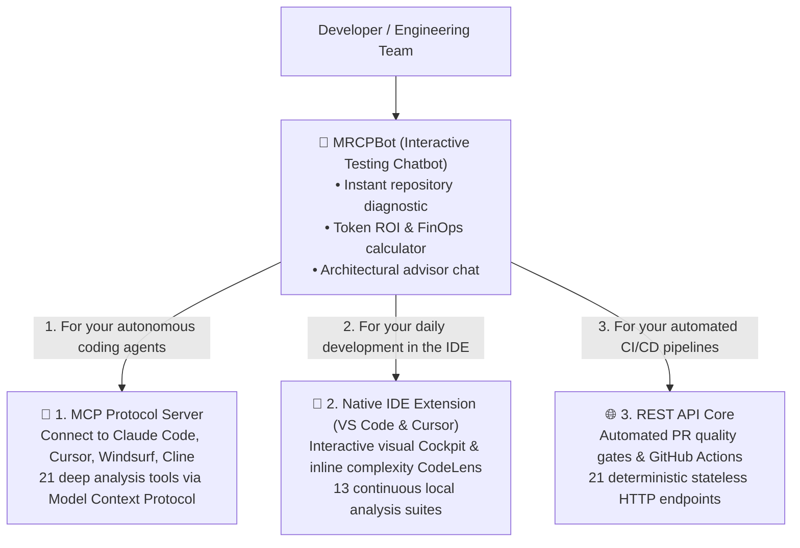

<div align="center">


# 🧠 MRCPBot

### The Interactive Diagnostic Chatbot & Token FinOps Curator for MRCP-Engine

**Test deterministic code analysis and real-time token ROI calculations directly from your browser.**

[🇧🇷 Ler em Português](README.pt-BR.md) · [🇬🇧 English](README.md)

[](https://github.com/faelscarpato/mrcpbot)
[](https://mrcp-engine.vercel.app)
[](LICENSE)
[](https://github.com/faelscarpato/mrcpbot/actions/workflows/ci.yml)

<br/>

</div>

---

## 💡 What is MRCPBot?

**MRCPBot** is the interactive gateway to the **MRCP-Engine** ecosystem. It acts as an **AI cost curator and architectural diagnostic chatbot**, allowing developers and engineering leaders to test, evaluate, and experience deterministic code intelligence without installing anything upfront.

With MRCPBot, you simply submit a public GitHub repository link or drop code files/documents to:
1. **Experience Instant Real-Time Diagnostics**: Inspect Maintainability Indexes, cyclomatic complexity, technical debt grades, critical hotspot files, and security risks parsed in seconds via AST (Tree-sitter WebAssembly).
2. **Audit Token ROI & Waste**: Review a side-by-side comparison of the cost and token volume required when feeding raw source files to AI coding agents versus structured, deterministic AST contracts.
3. **Chat with the AI Cost Curator**: Engage with an intelligent assistant powered by leading providers (Gemini, OpenAI, Claude, Nvidia, or local models) that analyzes your real repository data and recommends prioritized architectural refactoring strategies.

---

## 🧭 The Core Mission: Guiding You to the 3 Production Fronts

MRCPBot provides an initial playground to demonstrate the power of the **MRCP-Engine**. As you audit repositories and chat with the bot, it guides you to bring this deterministic intelligence into your daily workflows through its **3 production fronts**:



---

### 🔌 1. MCP Protocol Server (For Autonomous AI Agents)

If you use tools like **Claude Desktop**, **Claude Code**, **Cursor**, **Windsurf**, **Cline**, or **Roo Code**, wire them up with the official MCP server in a single command:

```bash
npx mrcp-engine setup
```

**Key Advantages:**
- **21 Deep Analysis Tools via MCP**: Coding agents stop reading raw source files and instead query type signatures, API routes, database models, dead code reachability, and OWASP compliance on demand.
- **Up to ~98% Token Reduction**: Agents consume a fraction of the prompt tokens per debug turn and respond significantly faster.

---

### 🧩 2. Native IDE Extension (VS Code, Cursor & Windsurf)

To run deterministic diagnostics continuously as you write code:

- Install directly from the marketplace: search for **`mrcp-engine`** in VS Code, Cursor, or Windsurf.
- Or install via CLI:
  ```bash
  code --install-extension mrcp-engine.mrcp-vscode
  ```

**Key Advantages:**
- **13 Local Continuous Analysis Suites**: Executes in ~2 seconds over your open workspace without sending your proprietary code to the cloud.
- **Inline Function CodeLens**: Displays complexity badges above functions with a 1-click action to copy a sanitized micro-contract directly into your AI chat.
- **Visual Cockpit**: Real-time Maintainability Index (A–F), technical debt metrics, and blast-radius impact analysis.

---

### 🌐 3. REST API Core (For CI/CD & Automations)

To enforce deterministic code quality and architectural rules in your delivery pipelines:

- **21 Stateless HTTP Endpoints**: Ready for GitHub Actions, GitLab CI, or custom DevOps tooling.
- **Automated Quality Gates**: Block pull requests that introduce circular dependencies, files with complexity exceeding team thresholds, or environment variables missing from `.env.example`.
- **Sample Request:**
  ```bash
  curl "https://mrcp-engine.vercel.app/api/code-health?repo=https://github.com/user/repository"
  ```

---

## ⚡ Getting Started with MRCPBot

1. **Access the Web App** or run it locally:
   ```bash
   git clone https://github.com/faelscarpato/mrcpbot.git
   cd mrcpbot
   pnpm install
   pnpm dev
   ```
2. **Enter any public GitHub repository URL** in the main input or pick one of the quick presets.
3. **Review the Initial Diagnostic**: Inspect the maintainability score, complexity distribution, line counts, and projected token savings.
4. **Chat with the Curator**: Ask questions about architectural bottlenecks, request step-by-step refactoring plans, or discover how to plug MRCP into your day-to-day tools.

---

## 📄 License

This project is licensed under the [MIT License](LICENSE).

<div align="center">
  <sub>Built with dedication by <a href="https://github.com/faelscarpato">Rafael Scarpato</a> and the open-source community.</sub>
</div>
