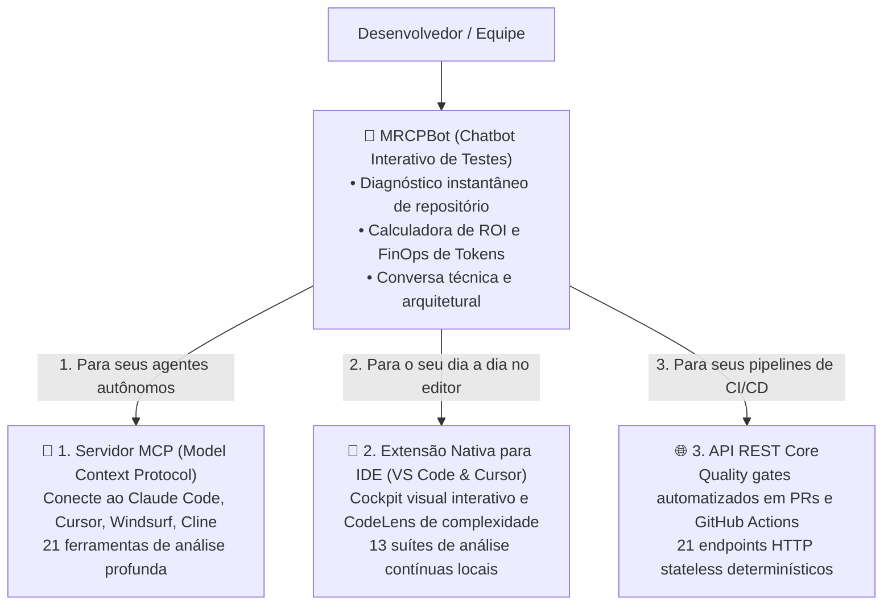

<div align="center">


# 🧠 MRCPBot

### O Chatbot Interativo de Diagnóstico & Curador de Custos para o MRCP-Engine

**Experimente a capacidade de análise determinística de código e cálculo de ROI de tokens diretamente na web.**

[🇧🇷 Ler em Português](README.pt-BR.md) · [🇬🇧 English](README.md)

[](https://github.com/faelscarpato/mrcpbot)
[](https://mrcp-engine.vercel.app)
[](LICENSE)
[](https://github.com/faelscarpato/mrcpbot/actions/workflows/ci.yml)

<br/>

</div>

---

## 💡 O que é o MRCPBot?

O **MRCPBot** é a porta de entrada interativa do ecossistema **MRCP-Engine**. Ele funciona como um **chatbot consultor e curador de custos de IA**, permitindo que qualquer desenvolvedor ou líder técnico teste e visualize o poder da análise determinística de código sem precisar instalar nada antecipadamente.

Com o MRCPBot, você simplesmente informa o link de um repositório público do GitHub ou envia arquivos de código/documentos para:
1. **Ver na prática o diagnóstico em tempo real**: Índices de manutenibilidade, complexidade ciclomática, débitos técnicos, arquivos críticos e riscos de segurança identificados em segundos via AST parser (Tree-sitter WASM).
2. **Auditar o ROI & Desperdício de Tokens**: Comparativo instantâneo do custo e volume de tokens de alimentar agentes de IA com arquivos brutos versus contratos estruturados determinísticos.
3. **Conversar com o Curador de IA**: Um chatbot inteligente integrado aos principais provedores (Gemini, OpenAI, Claude, Nvidia ou modelos locais) que analisa os dados reais do seu projeto e recomenda estratégias arquiteturais de refatoração.

---

## 🧭 O Objetivo do MRCPBot: Conectar Você às 3 Frentes de Uso

O MRCPBot serve como um ambiente de teste inicial para demonstrar o valor do **MRCP-Engine**. Conforme você analisa e conversa sobre o seu repositório, o bot orienta você a levar essa inteligência para o seu fluxo diário através das **3 frentes de uso**:



---

### 🔌 1. Servidor MCP (Para Agentes de IA Autônomos)

Se você já usa ferramentas como **Claude Desktop**, **Claude Code**, **Cursor**, **Windsurf**, **Cline** ou **Roo Code**, você pode transformar esses agentes instalando o servidor MCP oficial com um único comando:

```bash
npx mrcp-engine setup
```

**O que você ganha:**
- **21 ferramentas de análise profunda via MCP**: O agente para de ler arquivos inteiros e passa a consultar contratos de tipo, rotas de API, modelos de banco, alcançabilidade de código morto e segurança OWASP sob demanda.
- **Redução de até ~98% no consumo de tokens**: Seus agentes gastam frações de centavos por turno de depuração e respondem em segundos.

---

### 🧩 2. Extensão Nativa para IDE (VS Code, Cursor & Windsurf)

Para ter o diagnóstico acontecendo em tempo real durante a escrita do código:

- Instale direto do marketplace: busque por **`mrcp-engine`** no VS Code ou Cursor.
- Ou instale via terminal:
  ```bash
  code --install-extension mrcp-engine.mrcp-vscode
  ```

**O que você ganha:**
- **13 suítes de análise contínuas e locais**: Execução em ~2 segundos sobre o workspace aberto, sem enviar código para a nuvem.
- **CodeLens Inline**: Marcadores visuais de complexidade acima de funções com ação de 1 clique para copiar o microcontrato sanitizado para o chat de IA.
- **Cockpit Visual**: Painel interativo com notas de manutenibilidade (A–F), índice de débito e raio de impacto.

---

### 🌐 3. API REST Core (Para CI/CD & Automações)

Para integrar a inteligência determinística em pipelines de entrega contínua:

- **21 endpoints HTTP stateless**: Disponíveis para GitHub Actions, GitLab CI ou scripts internos.
- **Quality Gates Automatizados**: Bloqueie Pull Requests que introduzam dependências circulares, arquivos com complexidade acima do limite ou variáveis de ambiente ausentes no `.env.example`.
- **Exemplo de chamada:**
  ```bash
  curl "https://mrcp-engine.vercel.app/api/code-health?repo=https://github.com/usuario/repositorio"
  ```

---

## ⚡ Como Usar o MRCPBot

1. **Acesse a Aplicação Web** ou execute localmente:
   ```bash
   git clone https://github.com/faelscarpato/mrcpbot.git
   cd mrcpbot
   pnpm install
   pnpm dev
   ```
2. **Insira o URL de qualquer repositório público do GitHub** na barra principal ou selecione um dos exemplos rápidos.
3. **Analise o Relatório Inicial**: Visualize a nota de manutenibilidade, complexidade, volume de linhas e a economia projetada de tokens.
4. **Converse com o Bot**: Faça perguntas sobre gargalos do código, peça planos de refatoração ou entenda como plugar o MRCP nas suas ferramentas diárias.

---

## 📄 Licença

Este projeto é software livre sob a licença [MIT](LICENSE).

<div align="center">
  <sub>Criado com dedicação por <a href="https://github.com/faelscarpato">Rafael Scarpato</a> e a comunidade open-source.</sub>
</div>
