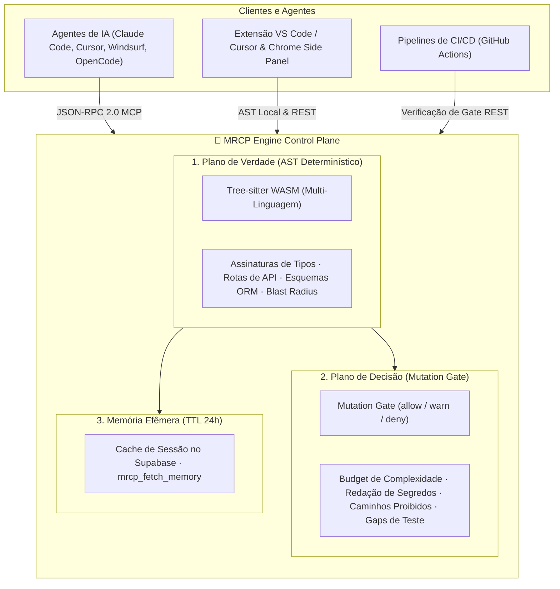

<div align="center">


# 🧠 MRCP Engine

### Inteligência de Código Determinística, RAG Estrutural & Governança de Mutações para Agentes de IA

**Pare de alimentar seu agente de IA com código-fonte bruto. Entregue inteligência determinística via AST e barreiras criptográficas de mutação.**

[🇬🇧 Read in English](README.md) · [🇧🇷 Ler em Português](README.pt-BR.md)

[](https://www.npmjs.com/package/mrcp-engine)
[](https://marketplace.visualstudio.com/items?itemName=mrcp-engine.mrcp-vscode)
[](https://modelcontextprotocol.io)
[](https://github.com/faelscarpato/mrcp-engine/actions/workflows/ci.yml)
[](LICENSE)

<br/>

| 🌐 1. REST API Core | 🔌 2. Servidor MCP | 🧩 3. Extensões IDE & Navegador |
| :--- | :--- | :--- |
| Endpoints HTTP stateless para pipelines de CI/CD, **Mutation Gate** automatizado e **Structural RAG** autônomo. | Interface JSON-RPC 2.0 zero-config que alimenta contratos de AST, cache efêmero de 24h e guardrails de segurança diretamente aos agentes. | Cockpit interativo, CodeLens inline no **VS Code / Cursor / Windsurf**, além de extensão nativa **Chrome Side Panel**. |

<br/>

[Início Rápido](#-início-rápido-30-segundos) · [Os Três Planos do MRCP](#-os-três-planos-do-mrcp) · [Catálogo de Ferramentas](#-catálogo-de-ferramentas) · [Referência da API REST](#-referência-da-api-rest) · [Extensão VS Code](#-extensão-ide-vs-code--cursor--windsurf) · [Extensão Chrome](#-extensão-de-navegador-google-chrome--manifest-v3)

</div>

---

## 🛑 O Problema: O "AI Tax" & Mutações Desgovernadas

Quando agentes de codificação interagem com repositórios reais, dois gargalos graves acontecem:

1. **O Custo de Ingestão ("AI Tax"):** Agentes leem arquivo por arquivo em texto bruto, consumindo milhares de tokens desnecessários. As respostas ficam lentas, a conta de tokens dispara e o modelo alucina sobre código lido pela metade.
2. **Mutações Desgovernadas de Agentes:** Agentes propõem alterações sem barreiras arquiteturais, introduzindo vazamento de segredos, violações de licenças, dependências circulares e complexidade sem cobertura de testes.

O **MRCP Engine** opera como o **control plane determinístico** entre o seu repositório e os agentes de IA:
- **Plano de Verdade (AST Determinístico):** Faz o parsing do código usando **Tree-sitter WebAssembly** na CPU local com zero inferência de LLM. Extrai micro-contratos tipados (~50–600 tokens) gerando ~98% de redução de contexto.
- **Plano de Decisão (Mutation Gate):** Valida matematicamente as mutações propostas pelo agente (`POST /api/mutation-gate`) contra limites de complexidade, regexes de segredos (com redação total de valor), caminhos proibidos e exigência de testes unitários.
- **Memória Efêmera de Sessão (TTL de 24h):** Persiste contratos no Supabase e injeta um UUID de sessão para evitar reprocessamento dispendioso do AST.



---

## ⚡ Início Rápido (30 segundos)

Configure automaticamente todas as IDEs e agentes compatíveis com MCP instalados na sua máquina com um único comando:

```bash
npx mrcp-engine setup
```

O comando detecta o ambiente e configura o servidor MCP para:

| | | | |
| :--- | :--- | :--- | :--- |
| 🟢 Claude Desktop | 🟢 Claude Code | 🟢 Cursor | 🟢 Windsurf |
| 🟢 VS Code | 🟢 Antigravity IDE | 🟢 Gemini CLI | 🟢 OpenCode |
| 🟢 Ollama (MCP) | 🟢 Codex | | |

### Configuração Manual

Adicione diretamente ao arquivo de configuração MCP do seu cliente:

```json
{
  "mcpServers": {
    "mrcp-engine": {
      "command": "npx",
      "args": ["-y", "mrcp-engine@latest"]
    }
  }
}
```

Ou conecte qualquer cliente compatível com HTTP remoto diretamente ao endpoint em nuvem sem dependências locais:

```json
{
  "mcpServers": {
    "mrcp-engine": {
      "url": "https://mrcp-engine.vercel.app/api/mcp",
      "transport": "streamable-http"
    }
  }
}
```

---

## 🎯 Os Três Planos do MRCP

### 1. 🔍 Plano de Verdade (Inteligência Determinística via AST)
Zero chamadas de LLM no caminho analítico. Avaliação 100% reproduzível e matemática via AST sobre TypeScript, JavaScript, Python, Go, Rust, Java, C/C++, PHP, Ruby, C#, SAP CDS, SAP ABAP e Oracle PL/SQL. Gera grafos de dependências, assinaturas estritas, esquemas OpenAPI e impacto de blast radius.

### 2. 🛡️ Plano de Decisão (Mutation Gate)
Fornece autorização determinística para diffs gerados por agentes antes do commit ou merge:
- **`max_files`**: Limita a amplitude de arquivos tocados por uma única alteração.
- **`forbidden_path`**: Protege arquivos sensíveis (`.env`, chaves privadas, certificados).
- **`secret_leak`**: Varre segredos AWS, GitHub, Supabase e chaves de API com redação absoluta (reporta apenas o tipo do segredo, nunca o valor real).
- **`complexity_budget`**: Recalcula a complexidade ciclomática real via AST do `code-health.ts`, sem confiar em métricas autodeclaradas pelo agente.
- **`test_coverage_gate`**: Detecta se arquivos de código em `src/` ou `packages/` possuem testes unitários irmãos ou declarados.

### 3. 💾 Memória Efêmera (Cache no Supabase com TTL de 24h)
Ao concluir análises complexas, o micro-contrato é salvo por 24 horas. O agente recebe a instrução:
```text
Contexto arquitetural salvo temporariamente (TTL: 24h). ID da Sessão: [UUID].
Para consultas futuras sobre esta arquitetura, utilize mrcp_fetch_memory(session_id).
```
O agente chama `mrcp_fetch_memory(session_id)` para recuperar o contexto instantaneamente, sem gastar CPU ou rede reprocessando o código.

---

## 📊 Telemetria Comprovada & FinOps

Testado em bases de código corporativas, o MRCP substitui a ingestão de contexto bruto por compressão determinística de AST:

| Métrica | Ingestão Bruta (Baseline) | MRCP Engine (Micro-Contrato AST) | Otimização Líquida |
| :--- | :--- | :--- | :--- |
| **Volume Analisado** | 1.936.508 tokens | **594 tokens** | **~98% de Redução de Contexto** |
| **Custo por Consulta (GPT-4o)** | ~$5,82 USD | **~$0,002 USD** | **~$5,81 USD economizados / query** |
| **Latência de Análise** | Vários minutos (geração de tokens) | **< 2,0s (Execução em CPU local)** | **Zero Sobrecarga de Nuvem** |
| **Precisão** | Heurística probabilística (alucinação) | **AST Determinístico + Gate Check** | **Verdade Matemática Comprovada** |

---

## 🛠 Catálogo de Ferramentas

<details open>
<summary><b>1. 🏛️ Núcleo do Motor & Memória Efêmera</b></summary>

| Ferramenta | Endpoint | Descrição |
| :--- | :--- | :--- |
| `analyze_repository` | `GET /api/analyze?repo=<url>` | Grafo de AST estrutural: nós (arquivos/módulos/funções), arestas, complexidade ciclomática e hotspots. Persiste sessão efêmera (TTL 24h). |
| `mrcp_run_full_repository_suite` | `GET /api/full-suite?repo=<url>` | Executa todas as ferramentas diagnósticas em paralelo, gera sumário executivo e salva sessão de 24h. |
| `mrcp_fetch_memory` | *(MCP & Interno)* | Recupera micro-contratos arquiteturais salvos na memória efêmera pelo `session_id` UUID dentro de 24 horas. |
| `get_repository_skills_contract` | `GET /api/skills?repo=<url>` | Contratos acionáveis de refatoração para arquivos com alta complexidade (> 50). |
| `mrcp_document_analyzer` | `GET /api/document-analyzer?repo=<url>` | Parser determinístico para arquivos não-código (PDF, DOCX, XLSX, CSV, JSON, YAML, XML, LOG) com Document Quality Index (DQI). |

</details>

<details open>
<summary><b>2. 🛡️ Governança & Mutation Gate</b></summary>

| Ferramenta | Endpoint | Descrição |
| :--- | :--- | :--- |
| `mrcp_gate_change` | `POST /api/mutation-gate` | Avalia mutações de código contra políticas arquiteturais (`allow/warn/deny`), validando delta de complexidade, redação de segredos, caminhos proibidos e presença de testes. |
| `mrcp_security_compliance_audit` | `GET /api/security-audit?repo=<url>` | Auditoria estática de segurança (vulnerabilidades OWASP, credenciais expostas, comandos de shell inseguros, licenças GPL). |
| `mrcp_impact_analysis` | `POST /api/impact-analysis` | Calcula o raio de impacto (blast radius) de alterações, mapeando arquivos, funções e testes impactados antes do commit. |
| `mrcp_architectural_drift_detector` | `GET /api/architecture-drift?repo=<url>` | Detecta dependências circulares (algoritmo de Tarjan) e quebras de camadas de Clean Architecture. |
| `mrcp_auto_test_coverage_gap_finder` | `GET /api/test-gap-analysis?repo=<url>` | Identifica fluxos de código sem teste e gera esqueletos de testes unitários para Vitest/Jest. |

</details>

<details open>
<summary><b>3. 🧬 Arquitetura Autônoma (Structural RAG)</b></summary>

| Ferramenta | Endpoint | Descrição |
| :--- | :--- | :--- |
| `mrcp_structural_rag_pipeline` | `POST /api/structural-rag` | Motor autônomo de pesquisa arquitetural. A partir de uma intenção de stack (ex: `"jwt fastify redis"`), pesquisa repositórios no GitHub via token de backend, extrai contratos cirúrgicos (50–600 tokens), valida no Mutation Gate e salva no Supabase. |

</details>

<details open>
<summary><b>4. ⚡ Otimização de Agentes & Contratos de Código</b></summary>

| Ferramenta | Endpoint | Descrição |
| :--- | :--- | :--- |
| `mrcp_api_contract_generator` | `GET /api/api-contract?repo=<url>` | Extrai definições de rotas e handlers em especificações OpenAPI 3.0 e SDKs TypeScript tipados. |
| `mrcp_type_signature_extractor` | `GET /api/type-signature-extractor?repo=<url>` | Extrai assinaturas estritas, declarações `.d.ts` e esquemas Zod descartando corpos de funções (~98% de economia de tokens). |
| `mrcp_sql_schema_orm_contract_generator` | `GET /api/sql-orm-contract?repo=<url>` | Mapeia esquemas Prisma, Drizzle, TypeORM e DDL SQL puro para representações tipadas. |
| `mrcp_dead_code_pruner` | `GET /api/dead-code-pruner?repo=<url>` | Análise de alcançabilidade identificando exports não utilizados, variáveis órfãs e imports mortos. |
| `mrcp_context_pruning_pack` | `GET /api/context-pack?repo=<url>&task=<desc>` | Fatiamento contextual de AST orientado a tarefas específicas do agente. |
| `mrcp_code_metrics_health_scorer` | `GET /api/code-health?repo=<url>` | Índice de Manutenibilidade SEI (0–100), notas de débito técnico (A–F) e distribuição de carga cognitiva. |
| `mrcp_monorepo_package_graph_analyzer` | `GET /api/monorepo-graph?repo=<url>` | Mapeia topologias de workspaces pnpm, Turborepo, Lerna e Nx e ordem ótima de build. |
| `mrcp_docstring_api_doc_generator` | `GET /api/doc-generator?repo=<url>` | Gera documentação TSDoc, JSDoc e docstrings Python para símbolos públicos sem documentação. |
| `mrcp_ast_refactor_applier` | `POST /api/refactor-applier` | Aplica refatorações em lote no AST (renomeação de símbolos, extração de interfaces) em ~30ms. |

</details>

---

## 🌐 Referência da API REST

Cada ferramenta analítica está disponível como endpoint HTTP stateless:

```bash
# Analisar AST de um repositório
curl "https://mrcp-engine.vercel.app/api/analyze?repo=https://github.com/facebook/react"

# Validar uma mutação no Mutation Gate
curl -X POST "https://mrcp-engine.vercel.app/api/mutation-gate" \
  -H "Content-Type: application/json" \
  -d '{"change": {"files": [{"path": "src/auth.ts", "content": "export const token = 123;"}]}}'

# Pesquisa arquitetural autônoma (Structural RAG)
curl -X POST "https://mrcp-engine.vercel.app/api/structural-rag" \
  -H "Content-Type: application/json" \
  -d '{"query": "fastify jwt auth redis"}'
```

| Endpoint | Método | Descrição |
| :--- | :--- | :--- |
| `/api/analyze?repo=<url>` | `GET` | Grafo de AST estrutural, arestas de dependência e complexidade. |
| `/api/mutation-gate` | `POST` | Verificação do Mutation Gate determinístico (`allow/warn/deny`). |
| `/api/structural-rag` | `POST` | Pesquisa estrutural e gerador de micro-contratos arquiteturais. |
| `/api/full-analysis` | `GET` | Executa todas as ferramentas diagnósticas em paralelo. |
| `/api/skills?repo=<url>` | `GET` | Contratos de refatoração para arquivos hotspot. |
| `/api/api-contract?repo=<url>` | `GET` | Extração de rotas, esquema OpenAPI 3.0 e SDK TypeScript. |
| `/api/code-health?repo=<url>` | `GET` | Índice de Manutenibilidade e esforço estimado de refatoração. |
| `/api/env-validator?repo=<url>` | `GET` | Validação de `.env`, detecção de vazamentos e esquemas Zod. |
| `/api/monorepo-graph?repo=<url>` | `GET` | Árvore de dependências entre pacotes de monorepo. |
| `/api/doc-generator?repo=<url>` | `GET` | Extração automática de JSDoc/TSDoc e tabelas Markdown. |
| `/api/refactor-applier` | `POST` | Refatoração em lote de símbolos no AST. |
| `/api/type-signature-extractor?repo=<url>` | `GET` | Extração de assinaturas de tipo sem corpos de função. |
| `/api/diff-summarizer` | `POST` | Agrupamento de diff semântico por nós de AST. |
| `/api/dead-code-pruner?repo=<url>` | `GET` | Detecção de variáveis, exports e funções não referenciadas. |
| `/api/sql-orm-contract?repo=<url>` | `GET` | Esquemas de banco a partir de Prisma, Drizzle, TypeORM e SQL DDL. |
| `/api/impact-analysis` | `POST` | Análise de blast radius de alterações (`body: { repoUrl, modifiedFiles }`). |
| `/api/security-audit?repo=<url>` | `GET` | Auditoria estática de segurança e verificação de licenças GPL. |
| `/api/architecture-drift?repo=<url>` | `GET` | Detecção de dependências circulares e camadas arquiteturais. |
| `/api/test-gap-analysis?repo=<url>` | `GET` | Gaps de cobertura com esqueletos de teste unitário. |
| `/api/context-pack?repo=<url>&task=<desc>` | `GET` | Pacote de contexto fatiado para tarefas específicas de agentes. |
| `/api/mcp` | `POST/GET` | Endpoint central JSON-RPC 2.0 streaming HTTP para agentes MCP e Discovery. |

---

## 🧩 Extensão IDE (VS Code · Cursor · Windsurf)

O cliente oficial de IDE integra a telemetria determinística do MRCP diretamente ao editor do desenvolvedor.

<div align="center">
  <a href="https://marketplace.visualstudio.com/items?itemName=mrcp-engine.mrcp-vscode">
    
  </a>
</div>

### Instalação

- **Pela interface:** Abra a aba de extensões (`Ctrl+Shift+X` / `Cmd+Shift+X`) no VS Code, Cursor ou Windsurf e busque por **`mrcp-engine`**.
- **Pelo terminal do VS Code:**
  ```bash
  code --install-extension mrcp-engine.mrcp-vscode
  ```
- **Pelo terminal do Cursor:**
  ```bash
  cursor --install-extension mrcp-engine.mrcp-vscode
  ```

### Funcionalidades Nativas no Editor

#### 1. 🏥 Cockpit Interativo Webview (Dashboard)
Executa análises de AST em ~2 segundos no workspace local sem qualquer chamada externa de rede:
- **Telemetria de ROI & FinOps:** Exibe economia exata de tokens e dólares por consulta comparando o tamanho bruto contra o pacote de AST comprimido (ex.: **1.936.508 tokens brutos comprimidos para 594 tokens de AST**, com **~98% de redução** e economia de **~$5,81 USD** por consulta).
- **Índice de Manutenibilidade:** Pontuação em tempo real no padrão SEI (0–100), médias de complexidade ciclomática e notas de débito técnico (A–F).
- **Matriz de Hotspots & God Modules:** Acesso direto para navegar até funções com complexidade crítica (> 50).
- **Inteligência Documental (DQI):** Pontuação e inferência de esquemas para arquivos não-código (PDF, DOCX, XLSX, CSV, Markdown).

#### 2. ⚡ CodeLens Inline por Função
Ativo em TypeScript, JavaScript, Python, Go, Rust, Java, C/C++, PHP, Ruby, C#, SAP CDS, SAP ABAP e Oracle PL/SQL:
- **Indicadores Visuais de Complexidade:** Exibe badges de complexidade ciclomática acima de cada função (ex: `⚡ MRCP: Complexidade 1 (Baixa 🟢)` vs `⚡ MRCP: Complexidade 20+ (Alta 🔴)`).
- **📋 Copiar para IA (Ação em 1 Clique):** Extrai cirurgicamente a assinatura da função, tipos de parâmetros e dependências imediatas em um micro-contrato limpo, evitando que a IA leia ou modifique seções não relacionadas.

#### 3. 🛡️ Barra Lateral de Atividades (6 Painéis Dedicados)
- **⚡ Ações Rápidas:** Executar diagnósticos completos, copiar contexto otimizado, disparar scans de segurança e exportar relatórios Markdown (`MRCP_DIAGNOSTIC_REPORT.md`).
- **🏥 Saúde & Métricas:** Notas de saúde em tempo real, métricas de manutenibilidade e distribuição de complexidade.
- **🛡️ Segurança & Segredos (.env):** Detecta variáveis de ambiente não declaradas e chaves expostas, direcionando alertas para o painel de Problemas do VS Code.
- **🏗️ Arquitetura & Dependências:** Detecção de imports circulares, árvores de rotas Next.js/FastAPI e grafos de pacotes.
- **🧪 Gaps de Testes & Código Morto:** Análise de alcançabilidade apontando variáveis mortas, exports não utilizados e funções complexas sem teste.
- **📄 Inteligência Documental:** Validação de esquemas tabulares e Document Quality Indexing (DQI).

#### 4. ⚙️ Configurações da Extensão
Personalize limites e recursos em `.vscode/settings.json`:
```json
{
  "mrcp.autoAnalyzeOnSave": false,
  "mrcp.enableCodeLens": true,
  "mrcp.enableNativeDiagnostics": true,
  "mrcp.maxFiles": 2000
}
```

### Comandos da Paleta (`Ctrl+Shift+P` / `Cmd+Shift+P`)

| Comando | Ação |
| :--- | :--- |
| `mrcp.runFullSuite` | Executa o diagnóstico completo em segundo plano. |
| `mrcp.openDashboard` | Abre o dashboard Cockpit interativo e visualizador de AST. |
| `mrcp.copyAiContext` | Copia o pacote de contexto de AST otimizado (~95–98% de redução de tokens). |
| `mrcp.copyFileContext` | Copia a assinatura estrutural e o contrato de tipos do arquivo ativo. |
| `mrcp.auditSecurity` | Executa inspeção estática de segurança e busca por chaves de `.env` vazadas. |
| `mrcp.detectDeadCode` | Executa análise de alcançabilidade para identificar código morto. |
| `mrcp.validateEnv` | Valida variáveis de ambiente contra o código-fonte. |
| `mrcp.exportReport` | Gera relatório consolidado em Markdown (`MRCP_DIAGNOSTIC_REPORT.md`). |
| `mrcp.refresh` | Reexecuta a análise incremental de AST e atualiza as visualizações. |

---

## 🌐 Extensão de Navegador (Google Chrome — Manifest V3)

O diretório [`mrcp-chrome-extension/`](apps/chrome-extension/README.md) disponibiliza uma extensão nativa em formato Chrome Side Panel:

- **Cockpit no Side Panel:** Diagnósticos arquiteturais direto no navegador sem interromper o fluxo de navegação.
- **Detecção Automática de Abas:** Identifica repositórios abertos no GitHub e GitLab e injeta o botão de ação rápida `⚡ MRCP Cockpit`.
- **Telemetria Diagnóstica em 1 Clique:** Nota de saúde, Índice de Manutenibilidade SEI, God Modules, Gaps de Teste e Segredos Expostos.
- **AI Context Packer:** Comprime o payload de contexto em até ~95% para colagem rápida no ChatGPT, Claude, Gemini ou Cursor.
- **Instalador:** Carregue o pacote empacotado diretamente em `chrome://extensions` em modo desenvolvedor.

Consulte o [Guia de Instalação da Extensão Chrome](apps/chrome-extension/README.md).

---

## 📡 Instância ao Vivo

Uma instância em nuvem está disponível para testes sem necessidade de instalação local:

**`https://mrcp-engine.vercel.app`**

```bash
curl "https://mrcp-engine.vercel.app/api/code-health?repo=https://github.com/facebook/react"
```

---

## 🗺 Roadmap

O roadmap de evolução do MRCP Engine segue um ciclo ágil de 90 dias com foco em governança, proveniência criptográfica e FinOps corporativo:

### ✅ Marcos Concluídos (v2.5 – v2.6)
- [x] **Núcleo do Plano de Verdade:** Motor de AST 100% determinístico multi-linguagem em Tree-sitter WASM (TypeScript, Python, Go, Rust, Java, C/C++, PHP, Ruby, C#, SAP CDS, SAP ABAP, Oracle PL/SQL).
- [x] **Suíte Diagnóstica Paralela:** 13 motores analíticos simultâneos com relatórios consolidados em Markdown.
- [x] **Extensão Nativa VS Code / Cursor / Windsurf:** Cockpit Webview interativo, CodeLens inline e 6 painéis dedicados na barra lateral.
- [x] **Extensão Google Chrome Side Panel:** Manifest V3 com detecção automática de repositórios no GitHub/GitLab e empacotador de contexto em 1 clique.
- [x] **Setup Zero-Config de Agentes:** `npx mrcp-engine setup` configurando automaticamente 10 IDEs e agentes de IA.
- [x] **Memória Efêmera de Sessão:** Cache no Supabase (TTL de 24h) com `mrcp_fetch_memory` e injeção automática de UUID de sessão nos rodapés.
- [x] **Plano de Decisão (Mutation Gate):** `POST /api/mutation-gate` e `mrcp_gate_change` com redação total de segredos, cálculo real de complexidade via AST e barreira de testes unitários.
- [x] **Structural RAG Autônomo:** `POST /api/structural-rag` e `mrcp_structural_rag_pipeline` extraindo micro-contratos compactos (< 600 tokens) com proveniência criptográfica (`contentHash` sha256).
- [x] **Saneamento e Higiene de Segurança:** Eliminação de runtimes legados de voz e mocks de LLM, sanitização estrita de variáveis de ambiente e suíte 100% verde (116 testes).

### 🚀 Próximas Entregas

#### 🔹 v2.7 — Automação de CI & Proveniência Criptográfica (Próxima Sprint)
- [ ] **GitHub Action Oficial:** Ação de CI dedicada para rodar o Mutation Gate em Pull Requests, publicando comentários automáticos de review com evidências do AST e bloqueando merges em caso de negação de política.
- [ ] **Grafo de Código Persistente & Snapshots por Commit:** Subgrafos ancorados por commit (`{file, symbol, byte_range, content_hash}`) garantindo citação rastreável em todas as respostas de agentes.
- [ ] **Plugin SDK (`@mrcp/sdk`):** Interfaces formais `defineRule`, `defineContract` e `defineGrammar` para extensões modulares da comunidade sem inchar o núcleo do motor.

#### 🔹 v3.0 — Terminal de Alta Densidade & FinOps Corporativo (Q1 2027)
- [ ] **Chat-CLI & Web Terminal:** Interface web dark mode de alta densidade (`#0A0A0A`) com Omnibox expansível, comandos slash (`/analyze`, `/gate`, `/rag`) e gestão segura de chaves BYOK no cliente (OpenAI, Gemini, Anthropic).
- [ ] **Prompt Caching Híbrido Nativo:** Separação estrita de prefixos estáticos de governança (reaproveitados em cache) e payloads dinâmicos de AST, capturando até 90% de desconto tarifário em provedores de LLM.
- [ ] **Dashboard de FinOps Corporativo Auditável:** Métricas em tempo real de tokens economizados, ROI financeiro por repositório/time e relatórios mensais executivos exportáveis.
- [ ] **Analisador de Topologia Multi-Repositório:** Mapeamento de grafos de dependências cruzadas entre pacotes e contratos de API para microsserviços e monorepos distribuídos.

---

## 🤝 Contribuição

Contribuições, relatórios de bugs e sugestões de novos recursos são bem-vindos. Consulte [CONTRIBUTING.md](CONTRIBUTING.md) para configurar o ambiente e [CODE_OF_CONDUCT.md](CODE_OF_CONDUCT.md) para diretrizes de comunidade.

## 📄 Licença

[MIT](LICENSE) © faelscarpato
