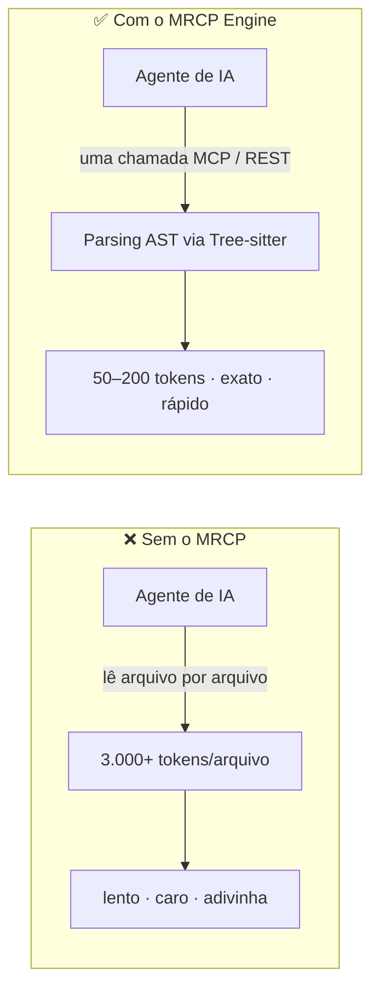

<div align="center">

# 🧠 MRCP Engine

### O Machine-Readable Context Protocol para Agentes de IA

**Pare de alimentar seu agente de IA com código-fonte bruto. Dê a ele inteligência estruturada.**

[🇬🇧 Read in English](README.md) · [🇧🇷 Português](README.pt-BR.md)

[](https://www.npmjs.com/package/mrcp-engine)
[](https://www.npmjs.com/package/mrcp-engine)
[](LICENSE)
[](CONTRIBUTING.md)
[](https://github.com/faelscarpato/mrcp-engine/actions/workflows/ci.yml)
[](https://modelcontextprotocol.io)

[Início Rápido](#-início-rápido-30-segundos) · [Por que MRCP](#-por-que-mrcp-engine) · [Ferramentas](#-catálogo-de-ferramentas) · [Demo ao Vivo](#-instância-ao-vivo) · [Como Contribuir](CONTRIBUTING.md)

</div>

---

## O problema

Toda vez que um agente de IA lê seu repositório abrindo arquivo por arquivo, ele paga o que este projeto chama de **"AI Tax"**: milhares de tokens desperdiçados, respostas mais lentas e uma chance real de alucinar sobre código que só leu pela metade.

O **MRCP Engine** é uma camada de inteligência determinística, baseada em AST, que fica entre seu repositório e seu agente de IA. Em vez de despejar arquivos brutos na janela de contexto, ele faz o parsing do seu código uma única vez com **Tree-sitter WebAssembly** e devolve exatamente o JSON estruturado que o agente pediu — grafos de arquitetura, auditorias de segurança, assinaturas de tipo, código morto, documentação e muito mais.



Sem chamadas de LLM, sem achismo — apenas parsing determinístico que transforma um repositório inteiro em um pacote de contexto que seu agente consegue de fato pagar para ler.

---

## ⚡ Início Rápido (30 segundos)

Configure automaticamente todas as IDEs e agentes de IA compatíveis com MCP instalados na sua máquina com um único comando:

```bash
npx mrcp-engine setup
```

Este comando detecta e configura o servidor MCP para:

|                   |                    |               |             |
| ----------------- | ------------------ | ------------- | ----------- |
| 🟢 Claude Desktop | 🟢 Claude Code     | 🟢 Cursor     | 🟢 Windsurf |
| 🟢 VS Code        | 🟢 Antigravity IDE | 🟢 Gemini CLI | 🟢 OpenCode |
| 🟢 Ollama (MCP)   | 🟢 Codex           |               |             |

Prefere configurar manualmente? Adicione isto ao seu client MCP:

```json
{
  "mcpServers": {
    "mrcp-engine": {
      "command": "npx",
      "args": ["-y", "mrcp-engine@latest"]
    }
  }
}
```

Ou aponte qualquer client com suporte a HTTP remoto (Antigravity, Cursor, Windsurf, VS Code) direto para a instância hospedada — sem instalar nada:

```json
{
  "mcpServers": {
    "mrcp-engine": {
      "url": "https://mrcp-engine.vercel.app/api/mcp",
      "transport": "streamable-http"
    }
  }
}
```

Seu client não tem suporte a MCP? Toda ferramenta também é um endpoint REST simples (`GET`/`POST`) — veja a [referência da API REST](#-referência-da-api-rest).

---

## 🤔 Por que MRCP Engine?

|                                         | Context stuffing tradicional                     | MRCP Engine                                                  |
| --------------------------------------- | ------------------------------------------------ | ------------------------------------------------------------ |
| **Como lê o código**                    | LLM relê o texto integral do arquivo             | Parsing AST determinístico via Tree-sitter                   |
| **Custo em tokens**                     | ~3.000 tokens por arquivo médio                  | ~50–200 tokens por resposta estruturada                      |
| **Consistência**                        | Varia conforme o prompt, pode alucinar estrutura | Mesmo schema JSON, sempre                                    |
| **Cobertura**                           | Um arquivo por vez                               | Grafo do repositório inteiro em uma chamada                  |
| **Ativos não-código**                   | Geralmente ignorados                             | CSV/DOCX/XLSX/PDF/JSON/YAML/XML via `mrcp_document_analyzer` |
| **Auditorias de segurança/arquitetura** | Prompting manual                                 | Ferramentas dedicadas                                        |

O MRCP não substitui o raciocínio do seu LLM — ele elimina a parte _cara e pouco confiável_ de colocar o código nesse raciocínio.

---

## 🎯 Dois Modos de Consumo

1. **⚡ Modo Modular** — chame exatamente a ferramenta que precisa (`mrcp_document_analyzer`, `mrcp_security_compliance_audit`, `mrcp_code_metrics_health_scorer`...) para uma tarefa pontual.
2. **🚀 Modo Full Suite** — uma única chamada (`mrcp_run_full_repository_suite` / `GET /api/full-analysis`) executa as 13 ferramentas de análise em paralelo, grava resultados intermediários em `mrcp-analysis.json` e devolve um relatório executivo consolidado.

---

## 🛠 Catálogo de Ferramentas

<details>
<summary><b>1. 🏗️ Core Engine & Inteligência Documental</b> — clique para expandir</summary>

| Ferramenta                       | Endpoint                                | O que faz                                                                                                                                                                                                                                                                                               |
| -------------------------------- | --------------------------------------- | ------------------------------------------------------------------------------------------------------------------------------------------------------------------------------------------------------------------------------------------------------------------------------------------------------- |
| `analyze_repository`             | `GET /api/analyze?repo=<url>`           | Grafo estrutural AST: nós (arquivos/módulos/funções), arestas (dependências), complexidade ciclomática, acoplamento e hotspots                                                                                                                                                                          |
| `mrcp_document_analyzer`         | `GET /api/document-analyzer?repo=<url>` | Analisador determinístico para repositórios **não-código**: CSV, TSV, TXT, MD, DOCX, XLSX, XLS, PDF (camada de texto), JSON, YAML, XML, LOG. Gera grafo de conhecimento, inferência de schema tabular com interfaces TypeScript, Document Quality Index (0–100) e detecção de links quebrados — sem OCR |
| `get_repository_skills_contract` | `GET /api/skills?repo=<url>`            | Contratos de refatoração para arquivos hotspot (complexidade > 50), impondo Zero Regression Policy em assinaturas públicas                                                                                                                                                                              |
| `mrcp_run_full_repository_suite` | `GET /api/full-suite?repo=<url>`        | Executa as 13 ferramentas em paralelo e grava o dashboard executivo                                                                                                                                                                                                                                     |

</details>

<details>
<summary><b>2. ⚡ Terceirização de Alta Eficiência para Agentes de IA</b> — clique para expandir</summary>

| Ferramenta                               | Endpoint                                       | O que faz                                                                                                                             |
| ---------------------------------------- | ---------------------------------------------- | ------------------------------------------------------------------------------------------------------------------------------------- |
| `mrcp_api_contract_generator`            | `GET /api/api-contract?repo=<url>`             | Extrai rotas/handlers (Next.js, Express, Fastify, Hono, FastAPI, Flask) → spec OpenAPI 3.0.3 + SDK TypeScript tipado, sem alucinações |
| `mrcp_monorepo_package_graph_analyzer`   | `GET /api/monorepo-graph?repo=<url>`           | Mapeia topologia pnpm/turborepo/lerna/nx, dependências entre pacotes, ordem topológica de build, pacotes afetados por um diff         |
| `mrcp_docstring_api_doc_generator`       | `GET /api/doc-generator?repo=<url>`            | Gera TSDoc/JSDoc/docstrings Python e tabelas Markdown de referência de API para símbolos públicos não documentados                    |
| `mrcp_ast_refactor_applier`              | `POST /api/refactor-applier`                   | Refatorações AST em lote — renomear símbolos, extrair interfaces, atualizar imports em dezenas de arquivos — em ~30ms                 |
| `mrcp_type_signature_extractor`          | `GET /api/type-signature-extractor?repo=<url>` | Extrai **apenas** assinaturas de tipo / `.d.ts` / schemas Zod, eliminando corpos de função (≈3.000 → 50 tokens)                       |
| `mrcp_git_diff_semantic_summarizer`      | `POST /api/diff-summarizer`                    | Remove ruído de formatação dos diffs, resume alterações por domínio semântico no nível AST                                            |
| `mrcp_dependency_compatibility_resolver` | `GET /api/dependency-resolver?package=<nome>`  | Resolve compatibilidade SemVer, conflitos de peer dependencies e risco de breaking changes contra o registro real do npm              |
| `mrcp_dead_code_pruner`                  | `GET /api/dead-code-pruner?repo=<url>`         | Análise de alcance AST para exportações não usadas, variáveis mortas e imports sem uso                                                |
| `mrcp_sql_schema_orm_contract_generator` | `GET /api/sql-orm-contract?repo=<url>`         | Faz parsing de Prisma / SQL DDL / Drizzle / TypeORM em tabelas e queries tipadas                                                      |

</details>

<details>
<summary><b>3. 🛡️ Engenharia Preditiva & Segurança</b> — clique para expandir</summary>

| Ferramenta                           | Endpoint                                       | O que faz                                                                                                                                                     |
| ------------------------------------ | ---------------------------------------------- | ------------------------------------------------------------------------------------------------------------------------------------------------------------- |
| `mrcp_code_metrics_health_scorer`    | `GET /api/code-health?repo=<url>`              | Índice de Manutenibilidade (0–100), nota de débito técnico (A–F), distribuição de carga cognitiva, top 5 prioridades de refatoração com estimativa de esforço |
| `mrcp_env_secret_contract_validator` | `GET /api/env-validator?repo=<url>`            | Mapeia uso de `process.env`/`os.environ`, audita contra `.env.example`, sinaliza risco de vazamento em bundles públicos, gera schemas Zod                     |
| `mrcp_impact_analysis`               | `POST /api/impact-analysis`                    | **Raio de impacto** AST — arquivos/testes afetados a jusante por uma mudança, antes do commit                                                                 |
| `mrcp_security_compliance_audit`     | `GET /api/security-audit?repo=<url>`           | Auditoria estática de segurança AST: padrões OWASP, segredos hardcoded, execução insegura de shell, dependências vulneráveis, exposição a licenças GPL        |
| `mrcp_architectural_drift_detector`  | `GET /api/architecture-drift?repo=<url>`       | Detecta desvio arquitetural, ciclos de dependência (algoritmo de Tarjan), violações de Clean Architecture                                                     |
| `mrcp_auto_test_coverage_gap_finder` | `GET /api/test-gap-analysis?repo=<url>`        | Mapeia funções de alta complexidade sem cobertura e gera stubs Vitest/Jest                                                                                    |
| `mrcp_context_pruning_pack`          | `GET /api/context-pack?repo=<url>&task=<desc>` | Fatiamento de contexto AST orientado à tarefa — 60–90% de economia de tokens                                                                                  |

</details>

<details>
<summary><b>4. 🌐 Busca e Extração Web</b> — clique para expandir</summary>

| Ferramenta              | Endpoint                                 | O que faz                                                                                                                                                                                            |
| ----------------------- | ---------------------------------------- | ---------------------------------------------------------------------------------------------------------------------------------------------------------------------------------------------------- |
| `mrcp_web_search`       | `GET /api/web-search?q=<query>`          | Busca rápida na web                                                                                                                                                                                  |
| `mrcp_web_scrape`       | `GET /api/scrape?url=<url>`              | Extração de texto limpo, sem anúncios/navegação/scripts                                                                                                                                              |
| `mrcp_web_smart_search` | `GET /api/smart-search?q=<query>&topN=2` | Busca + scraping ranqueado dos top N resultados                                                                                                                                                      |
| `mrcp_clone_page`       | `GET/POST /api/clone?url=<url>`          | **Motor PageCloner Pro:** Engenharia reversa completa de páginas em tokens de design, componentes, árvore de layout, heurística de propósito, necessidades de completação e prompt ultra-fiel para IA |

</details>

<details>
<summary><b>5. 👥 Triagem & RH</b> — clique para expandir</summary>

| Ferramenta                       | O que faz                            |
| -------------------------------- | ------------------------------------ |
| `mrcp_triage_parse_resume`       | Parsing determinístico de currículos |
| `mrcp_triage_score_candidate`    | Match score entre vaga e candidato   |
| `mrcp_triage_generate_hr_report` | Parecer técnico formatado para RH    |

</details>

---

## 🌐 Referência da API REST

Toda ferramenta MCP também é um endpoint HTTP simples — use de qualquer linguagem, sem precisar de um client MCP:

```bash
curl "https://mrcp-engine.vercel.app/api/analyze?repo=https://github.com/sua-org/seu-repo"
```

<details>
<summary>Tabela completa de endpoints</summary>

| Endpoint                                   | Método | Descrição                                             |
| ------------------------------------------ | ------ | ----------------------------------------------------- |
| `/api/analyze?repo=<url>`                  | `GET`  | Grafo AST e métricas de complexidade                  |
| `/api/skills?repo=<url>`                   | `GET`  | Contratos de refatoração para hotspots                |
| `/api/api-contract?repo=<url>`             | `GET`  | Extração de rotas, OpenAPI 3.0, SDK TypeScript        |
| `/api/code-health?repo=<url>`              | `GET`  | Índice de Manutenibilidade e débito técnico           |
| `/api/env-validator?repo=<url>`            | `GET`  | Validação de `.env`, alertas de vazamento, schema Zod |
| `/api/monorepo-graph?repo=<url>`           | `GET`  | Grafo de dependências entre pacotes e ordem de build  |
| `/api/doc-generator?repo=<url>`            | `GET`  | Gerador de JSDoc/TSDoc e referência de API            |
| `/api/refactor-applier`                    | `POST` | Refatorações AST em lote                              |
| `/api/type-signature-extractor?repo=<url>` | `GET`  | Extração apenas de assinaturas de tipo                |
| `/api/diff-summarizer`                     | `POST` | Resumo semântico de git diff                          |
| `/api/dependency-resolver?package=<nome>`  | `GET`  | Resolução de versão e compatibilidade                 |
| `/api/dead-code-pruner?repo=<url>`         | `GET`  | Detecção de código morto                              |
| `/api/sql-orm-contract?repo=<url>`         | `GET`  | Contratos tipados de banco/ORM                        |
| `/api/impact-analysis`                     | `POST` | Raio de impacto (`body: { repoUrl, modifiedFiles }`)  |
| `/api/security-audit?repo=<url>`           | `GET`  | Auditoria de segurança e licenças                     |
| `/api/architecture-drift?repo=<url>`       | `GET`  | Detecção de desvio arquitetural                       |
| `/api/test-gap-analysis?repo=<url>`        | `GET`  | Detecção de lacunas de teste e stubs                  |
| `/api/context-pack?repo=<url>&task=<desc>` | `GET`      | Pacote de contexto fatiado para LLMs                                        |
| `/api/clone?url=<url>`                     | `GET/POST` | **PageCloner Pro:** Tokens de design, componentes, layout e prompt de IA     |
| `/api/page-prompt?url=<url>`               | `GET`      | Atalho direto com prompt Markdown para reconstrução de interface             |
| `/api/full-analysis`                       | `GET`      | Suíte diagnóstica completa (13 ferramentas)                                 |
| `/api/mcp`                                 | `POST`     | Endpoint central MCP (JSON-RPC 2.0)                                         |

</details>

---

## 🧩 Extensão para IDE (VS Code · Cursor · Windsurf)

`apps/vscode` traz uma extensão nativa que leva a análise do MRCP direto para dentro do editor:

- **Sidebar** — Ações Rápidas, Métricas de Saúde (A–F / MI 0–100), Auditoria de Segurança & `.env`, Arquitetura & Dependências, Gaps de Teste & Código Morto, Inteligência Documental (DQI)
- **MRCP Cockpit** — dashboard visual: distribuição de complexidade, KPIs em tempo real, visualizador de grafo AST, tabelas de rotas/segurança com jump-to-code
- **CodeLens inline** — complexidade ciclomática em tempo real (`⚡ MRCP: Complexidade 3 (Baixa 🟢)`) e botão **Copiar para IA** com um clique em cada função/classe/método
- **Integração com o painel Problems** — alertas nativos para segredos expostos e variáveis ausentes no `.env`
- **AI Context Packer** — empacotamento de contexto com ~95% de economia de tokens, em um clique, para colar no ChatGPT, Claude ou Cursor

```bash
pnpm --filter mrcp-vscode compile
cd apps/vscode && npm run package   # → mrcp-vscode-2.6.0.vsix
```

---

## 📡 Instância ao Vivo

Já existe uma instância hospedada rodando — sem precisar configurar nada para testar:

**`https://mrcp-engine.vercel.app`**

```bash
curl "https://mrcp-engine.vercel.app/api/code-health?repo=https://github.com/facebook/react"
```

---

## 🗺 Roadmap

- [x] Suíte diagnóstica completa com 13 ferramentas em execução paralela
- [x] Extensão nativa para VS Code / Cursor / Windsurf
- [x] Inteligência documental para repositórios não-código
- [ ] **v3**: recuperação de conteúdo de arquivo sob demanda — solicitar um arquivo específico usando os metadados que o MRCP já retornou, e receber o conteúdo de volta em JSON estruturado (incluindo conteúdo visual quando aplicável)
- [ ] Expansão das gramáticas de linguagem além das 14+ atuais

Tem uma sugestão? [Abra uma issue de feature](../../issues/new?template=feature_request.md).

---

## 🤝 Como Contribuir

Issues, sugestões de features e PRs são bem-vindos — veja [CONTRIBUTING.md](CONTRIBUTING.md) para setup e diretrizes, e [CODE_OF_CONDUCT.md](CODE_OF_CONDUCT.md) para as expectativas da comunidade.

Se o MRCP Engine economizar tokens do seu agente (ou do seu bolso), uma ⭐ estrela ajuda de verdade outras pessoas a encontrarem o projeto.

## 📄 Licença

[MIT](LICENSE) © faelscarpato

---

<div align="center">

### ⭐ Histórico de Estrelas

[](https://star-history.com/#faelscarpato/mrcp-engine&Date)

</div>
