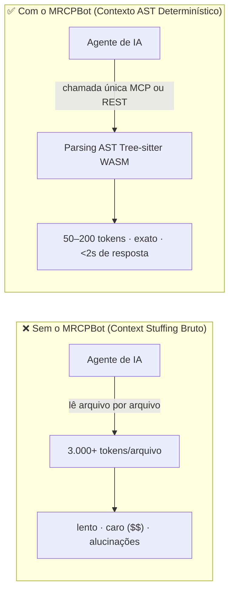
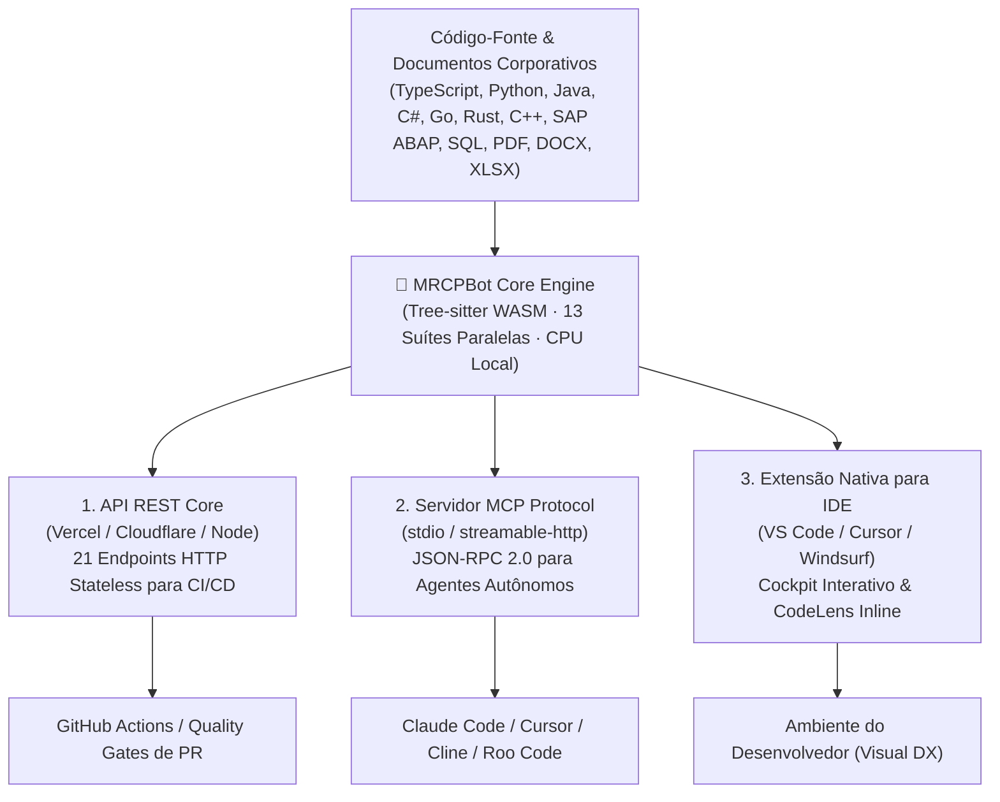

<div align="center">


# 🧠 MRCPBot

### Inteligência de Código Determinística, Contexto AST & FinOps para Agentes de IA

**Pare de alimentar seus agentes de IA com arquivos de código-fonte bruto. Forneça inteligência estruturada e determinística via AST.**

[🇬🇧 English](README.md) · [🇧🇷 Ler em Português](README.pt-BR.md)

[](https://github.com/faelscarpato/mrcpbot)
[](https://www.npmjs.com/package/mrcp-engine)
[](https://marketplace.visualstudio.com/items?itemName=mrcp-engine.mrcp-vscode)
[](LICENSE)
[](https://github.com/faelscarpato/mrcpbot/actions/workflows/ci.yml)
[](https://modelcontextprotocol.io)

<br/>

| 🌐 1. API REST Core | 🔌 2. Servidor Protocolo MCP | 🧩 3. Extensão Nativa para IDE |
| :--- | :--- | :--- |
| **21 endpoints HTTP** para pipelines de CI/CD, quality gates automatizados em PRs e automações. | **Interface JSON-RPC 2.0 sem configuração**, fornecendo microcontratos AST para agentes autônomos. | **Cockpit interativo**, CodeLens inline e alertas de segurança em tempo real no VS Code e Cursor. |

<br/>

[Início Rápido](#-início-rápido-30-segundos) · [Formas de Consumo](#-três-formas-de-consumir-o-mrcpbot) · [Por que MRCPBot](#-por-que-mrcpbot) · [Catálogo de Ferramentas](#-catálogo-de-ferramentas) · [Referência da API REST](#-referência-da-api-rest) · [Extensão IDE](#-extensão-nativa-para-ide-vs-code--cursor--windsurf) · [Deploy](#-deploy-em-nuvem-vercel--cloudflare)

</div>

---

## 💥 O Problema: A "Taxa de Tokens de IA"

Toda vez que um agente de IA lê seu repositório abrindo arquivo por arquivo bruto, você paga o custo da **"AI Token Tax"**: milhares de tokens desperdiçados, respostas lentas, custo exponencial por consulta e grande probabilidade de alucinações sobre trechos de código lidos fora de contexto.

O **MRCPBot** opera como uma camada de inteligência determinística e otimização FinOps entre seus repositórios e seus agentes de IA (Claude Code, Cursor, Windsurf, Cline, Copilot, ChatGPT). Baseado em **Tree-sitter WebAssembly** executando localmente na CPU, ele faz o parsing da base de código uma única vez sem chamar LLMs e devolve contratos JSON estritamente tipados: grafos de dependência, assinaturas de tipo, auditorias de segurança OWASP, análise de código morto e detecção de drift arquitetural.



---

## ⚡ Início Rápido (30 segundos)

### 1. Configuração Automática de Clientes MCP

Detecta e configura automaticamente o servidor MCP em todas as IDEs e agentes instalados:

```bash
npx mrcp-engine setup
```

Compatível nativamente com:

|                   |                    |               |             |
| ----------------- | ------------------ | ------------- | ----------- |
| 🟢 Claude Desktop | 🟢 Claude Code     | 🟢 Cursor     | 🟢 Windsurf |
| 🟢 VS Code        | 🟢 Antigravity IDE | 🟢 Gemini CLI | 🟢 OpenCode |
| 🟢 Ollama (MCP)   | 🟢 Codex           | 🟢 Cline      | 🟢 Roo Code |

### 2. Configuração Manual no Cliente MCP

Adicione ao arquivo de configuração `mcpServers` do seu editor:

```json
{
  "mcpServers": {
    "mrcpbot": {
      "command": "npx",
      "args": ["-y", "mrcp-engine@latest"]
    }
  }
}
```

### 3. Conexão HTTP Remota (Sem dependências locais)

Conecte qualquer cliente com suporte a MCP remoto (Cursor, Windsurf, VS Code) diretamente ao endpoint hospedado:

```json
{
  "mcpServers": {
    "mrcpbot": {
      "url": "https://mrcp-engine.vercel.app/api/mcp",
      "transport": "streamable-http"
    }
  }
}
```

---

## 🎯 Três Formas de Consumir o MRCPBot



### 1. 🌐 API REST Core (CI/CD e Automações)
Endpoints HTTP stateless ideais para GitHub Actions ou scripts internos. Permite bloquear PRs com violações de arquitetura, loops circulares ou falhas críticas de segurança antes do merge.

### 2. 🔌 Servidor de Protocolo MCP (Agentes de IA)
Implementa a especificação Model Context Protocol (JSON-RPC 2.0). Entrega contratos com delimitações claras de escopo e proibições de modificações não autorizadas, prevenindo alucinações.

### 3. 🧩 Extensão Nativa para IDE (VS Code & Cursor)
Publicada no Visual Studio Marketplace. Traz telemetria de ROI de tokens, alertas no painel de problemas e CodeLens com ação de 1 clique para copiar o contrato exato para seu chat de IA.

---

## 📊 Telemetria e ROI Comprovados

Em benchmarks executados contra repositórios corporativos, o MRCPBot substitui a ingestão bruta por compactação AST determinística:

| Métrica | Ingestão Bruta Tradicional | Pacote AST MRCPBot | Otimização Líquida |
| :--- | :--- | :--- | :--- |
| **Volume Analisado** | 1.936.508 tokens | **594 tokens** | **~98% de Redução de Contexto** |
| **Custo por Consulta (GPT-4o)** | ~$5.82 USD | **~$0.002 USD** | **~$5.81 USD economizados / query** |
| **Latência de Análise** | Minutos (geração de tokens) | **< 2.0s (Execução local em CPU)** | **Resposta Instantânea** |
| **Precisão** | Probabilística (risco de alucinação) | **13 suítes determinísticas** | **Ground Truth Determinístico** |

> **Impacto FinOps:** Em uma equipe de 10 desenvolvedores realizando 20 consultas arquiteturais por dia, o MRCPBot economiza mais de **$25.000 USD/mês** em custos de inferência de LLMs.

---

## 🛠 Catálogo de Ferramentas

<details open>
<summary><b>1. 🏗️ Motor Principal e Inteligência Documental</b></summary>

| Ferramenta | Endpoint | Descrição |
| :--- | :--- | :--- |
| `analyze_repository` | `GET /api/analyze?repo=<url>` | Grafo estrutural AST, dependências, complexidade ciclomática e hotspots. |
| `mrcp_document_analyzer` | `GET /api/document-analyzer?repo=<url>` | Parser para arquivos não-código: CSV, TSV, MD, DOCX, XLSX, PDF (camada de texto), JSON, YAML, XML, LOG. Gera schemas tipados e Índice de Qualidade Documental (DQI). |
| `get_repository_skills_contract` | `GET /api/skills?repo=<url>` | Gera contratos de refatoração para arquivos hotspot (complexidade > 50) com regras de zero regressão. |
| `mrcp_run_full_repository_suite` | `GET /api/full-suite?repo=<url>` | Executa em paralelo as 13 ferramentas diagnósticas e devolve relatório consolidado. |

</details>

<details open>
<summary><b>2. ⚡ Otimização e Desoneração de Agentes</b></summary>

| Ferramenta | Endpoint | Descrição |
| :--- | :--- | :--- |
| `mrcp_api_contract_generator` | `GET /api/api-contract?repo=<url>` | Extrai rotas (Next.js, Express, Fastify, Hono, FastAPI, Flask) em especificações OpenAPI 3.0.3 e SDKs TypeScript. |
| `mrcp_monorepo_package_graph_analyzer` | `GET /api/monorepo-graph?repo=<url>` | Mapeia topologia de monorepos pnpm, Turborepo, Lerna e Nx, árvore de dependências e ordem de compilação. |
| `mrcp_docstring_api_doc_generator` | `GET /api/doc-generator?repo=<url>` | Gera documentações TSDoc, JSDoc, Python docstrings e tabelas Markdown para símbolos não documentados. |
| `mrcp_ast_refactor_applier` | `POST /api/refactor-applier` | Aplica refatorações em lote (renomeação de símbolos, extração de interfaces e ajustes de imports) em ~30ms. |
| `mrcp_type_signature_extractor` | `GET /api/type-signature-extractor?repo=<url>` | Extrai assinaturas de tipo e schemas Zod, descartando corpos de implementação. |
| `mrcp_git_diff_semantic_summarizer` | `POST /api/diff-summarizer` | Remove ruídos de formatação e resume alterações semânticas por nós da AST. |
| `mrcp_dependency_compatibility_resolver` | `GET /api/dependency-resolver?package=<name>` | Avalia compatibilidade SemVer e conflitos de dependências peer contra registros em tempo real. |
| `mrcp_dead_code_pruner` | `GET /api/dead-code-pruner?repo=<url>` | Análise de alcançabilidade identificando exports não utilizados e funções mortas. |
| `mrcp_sql_schema_orm_contract_generator` | `GET /api/sql-orm-contract?repo=<url>` | Extrai schemas tipados a partir de Prisma, Drizzle, TypeORM e DDL SQL puro. |

</details>

<details open>
<summary><b>3. 🛡️ Engenharia Preditiva e Auditoria de Segurança</b></summary>

| Ferramenta | Endpoint | Descrição |
| :--- | :--- | :--- |
| `mrcp_code_metrics_health_scorer` | `GET /api/code-health?repo=<url>` | Índice de Manutenibilidade (0–100), notas técnicas (A–F) e distribuição de carga cognitiva. |
| `mrcp_env_secret_contract_validator` | `GET /api/env-validator?repo=<url>` | Valida paridade de variáveis de ambiente com o `.env.example` e previne vazamentos de credenciais. |
| `mrcp_impact_analysis` | `POST /api/impact-analysis` | Calcula o raio de impacto na AST identificando todos os arquivos e testes afetados por alterações. |
| `mrcp_security_compliance_audit` | `GET /api/security-audit?repo=<url>` | Audita vulnerabilidades OWASP, credenciais expostas, comandos inseguros de shell e licenças GPL. |
| `mrcp_architectural_drift_detector` | `GET /api/architecture-drift?repo=<url>` | Detecta importações circulares (algoritmo de Tarjan) e quebras de camadas arquiteturais. |
| `mrcp_auto_test_coverage_gap_finder` | `GET /api/test-gap-analysis?repo=<url>` | Mapeia trechos complexos sem cobertura de testes e gera scaffolds de testes Vitest/Jest. |
| `mrcp_context_pruning_pack` | `GET /api/context-pack?repo=<url>&task=<desc>` | Slicing de contexto orientado à tarefa descartando arquivos não correlatos (redução de 60–90% de tokens). |

</details>

<details>
<summary><b>4. 🌐 Busca Web e Engenharia Reversa</b></summary>

| Ferramenta | Endpoint | Descrição |
| :--- | :--- | :--- |
| `mrcp_web_search` | `GET /api/web-search?q=<query>` | Busca web sem necessidade de chave de API. |
| `mrcp_web_scrape` | `GET /api/scrape?url=<url>` | Extração limpa de conteúdo em Markdown sem navegações ou propagandas. |
| `mrcp_web_smart_search` | `GET /api/smart-search?q=<query>&topN=2` | Busca combinada com extração contextual profunda dos principais resultados. |
| `mrcp_clone_page` | `GET/POST /api/clone?url=<url>` | **PageCloner Pro:** Desconstrói interfaces em tokens de design, componentes DOM e prompts de reconstrução. |

</details>

---

## 🌐 Referência da API REST

Qualquer analisador pode ser acionado por chamadas HTTP:

```bash
# Analisa saúde e métricas de manutenibilidade do repositório
curl "https://mrcp-engine.vercel.app/api/code-health?repo=https://github.com/faelscarpato/mrcpbot"

# Gera pacote de contexto AST compacto para uma tarefa
curl "https://mrcp-engine.vercel.app/api/context-pack?repo=https://github.com/faelscarpato/mrcpbot&task=refactor-auth"
```

| Endpoint | Método | Descrição |
| :--- | :--- | :--- |
| `/api/code-health?repo=<url>` | `GET` | Índice de manutenibilidade, notas técnicas e esforço estimado. |
| `/api/context-pack?repo=<url>&task=<desc>` | `GET` | Gera fatias de contexto AST otimizadas para o prompt do agente. |
| `/api/analyze?repo=<url>` | `GET` | Grafo estrutural AST, arestas de dependência e complexidade. |
| `/api/skills?repo=<url>` | `GET` | Contratos de refatoração para arquivos hotspot com política de zero regressão. |
| `/api/api-contract?repo=<url>` | `GET` | Extração de rotas, especificações OpenAPI 3.0 e SDK TypeScript. |
| `/api/env-validator?repo=<url>` | `GET` | Validação de `.env` contra referências de código e auditoria de vazamento. |
| `/api/monorepo-graph?repo=<url>` | `GET` | Topologia de pacotes em monorepo e ordem de compilação. |
| `/api/security-audit?repo=<url>` | `GET` | Auditoria estática de segurança, dependências e conformidade de licenças. |
| `/api/architecture-drift?repo=<url>` | `GET` | Detecção de ciclos de importação e quebra de fronteiras arquiteturais. |
| `/api/dead-code-pruner?repo=<url>` | `GET` | Análise de alcançabilidade destacando código e exports não referenciados. |
| `/api/full-analysis` | `GET` | Execução paralela em chamada única de todos os 13 motores diagnósticos. |
| `/api/mcp` | `POST` | Endpoint central JSON-RPC 2.0 streaming HTTP para agentes remotos. |

---

## 🧩 Extensão Nativa para IDE (VS Code · Cursor · Windsurf)

O cliente oficial de IDE integra a inteligência do MRCPBot diretamente ao seu ambiente de trabalho:

<div align="center">
  <a href="https://marketplace.visualstudio.com/items?itemName=mrcp-engine.mrcp-vscode">
    
  </a>
</div>

### Instalação

* **Pelo Marketplace do Editor:** Busque por **`mrcp-engine`** no VS Code, Cursor ou Windsurf.
* **Via CLI do VS Code:**
  ```bash
  code --install-extension mrcp-engine.mrcp-vscode
  ```
* **Via CLI do Cursor:**
  ```bash
  cursor --install-extension mrcp-engine.mrcp-vscode
  ```

### Funcionalidades Nativas

1. **Dashboard Cockpit Interativo:** Executa 13 suítes AST em ~2 segundos no workspace local com zero tráfego de rede. Exibe índice de manutenibilidade, telemetria de ROI de tokens e notas de débito técnico.
2. **CodeLens Inline nas Funções:** Badges de complexidade diretamente sobre assinaturas (ex.: `⚡ MRCP: Complexidade 1 (Baixa 🟢)`) com ação de 1 clique para copiar o contrato exato para seu agente de IA.
3. **Barra Lateral com 6 Painéis Dedicados:** Ações Rápidas, Saúde & Métricas, Segurança & Segredos (.env), Arquitetura & Dependências, Gaps de Testes & Código Morto e Inteligência Documental.

---

## 🚀 Deploy em Nuvem (Vercel & Cloudflare)

O MRCPBot foi projetado para deploy imediato sem configurações manuais:

### Deploy na Vercel

Configurado via `vercel.json` com roteamento para funções serverless (`/api/*`) e hospedagem estática da SPA:

```bash
vercel deploy --prod
```

### Deploy no Cloudflare Pages

Configurado via `wrangler.toml`, com `public/_redirects` e `public/_headers` para SPA fallback:

```bash
pnpm build
wrangler pages deploy dist --project-name=mrcpbot
```

---

## 🛠️ Desenvolvimento & Contribuição

```bash
# Clone o repositório
git clone https://github.com/faelscarpato/mrcpbot.git
cd mrcpbot

# Instale dependências (gerenciadas por workspaces pnpm)
pnpm install

# Execute linters e testes
pnpm lint
pnpm test

# Inicie o servidor de desenvolvimento
pnpm dev
```

Contribuições são sempre bem-vindas! Consulte [CONTRIBUTING.md](CONTRIBUTING.md) e o [CODE_OF_CONDUCT.md](CODE_OF_CONDUCT.md).

---

## 📄 Licença

Este projeto está sob a licença [MIT](LICENSE) © faelscarpato.

<div align="center">
  <sub>Construído com dedicação por <a href="https://github.com/faelscarpato">Rafael Scarpato</a> e a comunidade open-source.</sub>
</div>
